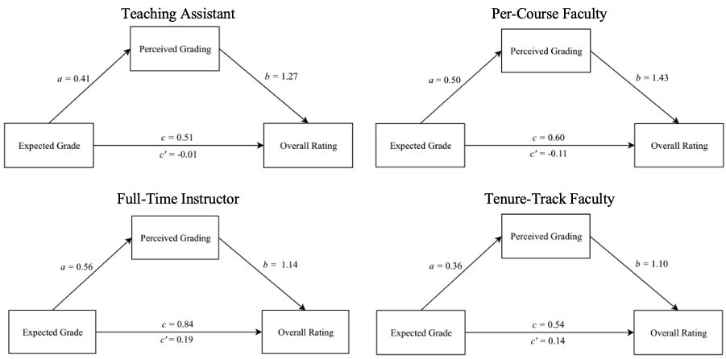

```{r load_packages, include = FALSE}
library("papaja")
library(nlme)
library(ggplot2)
library(reghelper)
knitr::opts_chunk$set(cache = TRUE)

####Bootstrapping the Mediation Effect####
##write a function that gives you the numbers you want
##we want the indirect effect
indirectsaved = function(dataset, random) {
  d = dataset[random, ] #randomize by row
  apath = lme(average ~ zq15 + People, 
                  data = d, 
                  method = "ML", 
                  na.action = "na.omit",
                  random = ~1|instructcode)
  bpath = lme(q1 ~ zq15 + zaverage + People, 
                  data = d, 
                  method = "ML", 
                  na.action = "na.omit",
                  random = ~1|instructcode)
  
  indirect = coef(apath)[1,2] * coef(bpath)[1,3]
  
  return(indirect)
}

library(boot)
##change nsims to lower so it knits, use 1000 for manuscript
#nsims = 1000
nsims = 10

```

Student evaluations of professors are a typical practice, but their validity and reliability has been disputed. The impact of student evaluations on professor advancement can be great and often acts as a deciding factor in professor promotion, demotion, coursework choice, tenureship, or used to inform access to certain funding opportunities. Some suggest that there are variables that result in improving evaluations, such as giving higher grades [@Greenwald1997; @Isely2005; @Krautmann1999]. Student evaluations are also influenced by likability, attractiveness, and dress [@Buck1989; @HughFeeley2002; @Gurung2007]. Further, 20 years ago, @Neath1996 suggested twenty tongue-in-cheek tips in which professors may bolster their evaluations from students. These suggestions have no relationship with research supported instructional methods or further learning retention among the student body, such as being a male professor and only teaching only male students. In more recent research, @Boring2016 confirms that student evaluations of teaching are biased against female instructors, and the authors conclude student evaluations are more representative of the students' grading expectations and biases rather than an evaluation of objective instructional methods. All together, these findings elicit the argument that student evaluations are not necessarily measuring whether the instructional methods of professors are sound, rather student evaluations of instruction are measuring whether or not the instructor met the students' expectations of their performance in the classroom, in addition to the instructor meeting pre-existing biases. 

However, this finding does not imply that an instructor can simply raise grades to meet expections [@Centra2003; @Marsh1987; @Marsh2000], instead one should consider the effect of "perceived grading". We operationally define perceived grading as the students' perceptions of assignment appropriateness, grading fairness, and the expected course grade at the time the evaluations are being completed. Social psychology theory would support that students with low perceived grading perceptions may reduce cognitive dissonance and engage in ego defense by giving low evaluations in turn [@Maurer2006], resulting in decreased validity and reliability of the proposed construct, professor instruction. We argue both social psychology theory and the evidence from student evaluations supports that higher perceived grading can lead to better student evaluations of instruction. For example, @Salmons1993 provided causal evidence of lowered student evaluations due to expected grades. In her study of 444 students completing faculty evaluations at two separate points in a semester, students who expected to get Fs significantly lowered their evaluations while students who expected to receive As and Bs significantly raised their evaluations [@Salmons1993]. This theory and evidence from student evaluation leads us to further argue student evaluations of professors are biased towards their expected grade and the perceived fairness of the grading system, rather than the actual instructional methods used over the course of a semester. 

Much of the literature on student evaluations involves diverse and complex analyses (e.g., @Marsh1987) and lacks social-psychological theoretical guidance on human judgment. To expect that student evaluations would not be influenced by expected grade would contradict a long-standing history of social psychology research on cognitive dissonance, attribution, and ego threat. As we know, failure threatens the ego [@Miller1985] and motivates us to find rationales to defend the ego. Further, @Kenworthy2011 found guilt as a significant correlate of dissonance which may be illuminated in this study by the guilt of underperforming from a student's own expectations. Failing students, or those performing below personal expectations, would be expected to defend their ego by attributing low grades to poor teaching or unfair evaluation practices [@Maurer2006]. One common strategy involves diminishing the value of the activity [@Miller1989], which would result in lowered perceived value of a course.

Similarly, Cognitive Dissonance Theory [@Festinger1957] predicts that people who experience poor performance but perceive themselves as competent will experience dissonance, of which they can reduce through negative evaluations of the instruction [@Maurer2006]. Attribution research [@Weiner1992] also supports the argument that among low achievement motivation students, failure is associated with external attributions for cause, and the most plausible external attribution for the student in the evaluation context is the quality of instruction and grading practices. Although arguments regarding degree of influence are reasonable, the position that they are not affected is inconsistent with existing and established theory. Thus, it is not surprising that the majority of faculty perceive student evaluations to be biased by perceived grading and course choice [@Marsh1987].

@Blackhart2006 analyzed 167 psychology classes in a multiple regression analysis and found that the two most significant predictors of instructor ratings were average grade given by the instructor and instructor status (teaching assistant or ranked faculty). Because of the limited number of classes, the power of the analysis was limited. However, in addition to the concern regarding the relationship between grades and global course evaluations, it was found that teaching assistants were rated more highly than ranked faculty. This finding raises additional questions on validity student evaluation of instructional quality. We must either accept that the least trained and qualified instructors are actually better teachers, or we must believe this result suggests that student evaluations have given us false information on the quality of instruction via their perceptions of grading. Research from @DuCette1982 and @Ellis2003 also showed medium to large correlations between expected grade and course ratings. However, these studies did not consider the predictive relationship for instructors across different courses and semesters, which was one aim of the current study. Using nearly twenty years of data from a large midwestern university, the following research questions were examined:

  1) If ratings are, in fact, valid measures of instructor attributes, it should be expected that ratings would have some stability across semesters and specific courses. If variation were due to instructor attributes and not the course they are assigned, we would expect ratings to be most stable across two different courses during the same semester. We would expect these correlations to decline somewhat for the same course in a different semester, since faculty members may improve or decline with experience. But if they are reliable and stable enough to use in making choices about retention, their stability should be demonstrated across different semesters, as well. Therefore, in the current study, we first sought to establish if ratings are reliable for instructors across courses and semesters. This analysis was conducted by calculating all possible correlations between each average course rating in the dataset to examine course (same/different) by semester (same/different) by instructor (same/different) reliability.
  
  2) After examining reliability, we sought to show that items on instructor evaluations were positively correlated, demonstrating that overall course evaluations are related to perceived grading ratings from the students. 

  3) Given the proposed differences in ratings by instructor type [@Blackhart2006], we examined a moderated mediation analysis to portray the expected relationship of the variables across instructor type. First, for the mediation analysis, we hypothesized that expected grade predicted overall course rating, with perceived grading ratings mediating that relationship. With this analysis, we would demonstrate that evaluations are not merely a measure of expected grade, but also influenced by grading system used in the course (i.e., students with higher grades likely perceive grading to be more fair/appropriate, which then influences their ratings of the course). This mediation was expected to be moderated by instructor type, as previous research has shown that different types of instructors (teaching assistants, ranked faculty) appear to receive different ratings overall. 

# Method

```{r load-data, include = FALSE}
master = read.csv("all_evals.csv")

#remove Gs that were only used for online rendering
master$Course = as.numeric(gsub("G", "", master$Course))

#drop things below 100 don't know what those are
#drop things above 500 as those are graduate courses
##q1, q3, q4, q9, q15
reduced = master[master$Course >= 100 & master$Course < 600 , -c(5, 10, 13:16, 18:22) ]

reduced$type = factor(reduced$type,
                        levels = 1:4,
                        labels = c("TA", "Per Course", 
                                   "Instructor", "Tenure Track"))
reduced$type = factor(reduced$type,
                      levels = c("Tenure Track", "TA", "Per Course", "Instructor"))
```

The archival study was conducted using data from the psychology department at a large Midwestern public university. We used data from `r nrow(master[ master$Course < 500 , ])` undergraduate, `r nrow(master[ master$Course >= 500 & master$Course < 600 , ])` mixed-level undergraduate, and `r nrow(master[ master$Course >=600 , ])` graduate psychology classes taught from 1987 to 2016 that were evaluated by students using the same 15-item instrument. The graduate courses were excluded from analyses due to the ceiling effects on expected grades. Faculty followed set procedures in distributing scan forms no more than two weeks before the conclusion of the semester. A student was assigned to collect the forms and deliver them to the departmental secretary. The instructor was required to leave the room while students completed the forms. 

We focused upon the five items, which seemed most pertinent to the issues of perceived grading and evaluation. We were most interested in how grades related to global course evaluation and grading/assignment evaluations. These items were presented with a five-point scale from 1 (*strongly disagree*) to 5 (*strongly agree*):  

  1) The overall quality of this course was among the top 20% of those I have taken. 
  2) The examinations were representative of the material covered in the assigned readings and class lectures. 
  3) The instructor used fair and appropriate methods in the determination of grades. 
  4) The assignments and required activities in this class were appropriate. 
  5) What grade do you expect to receive in this course? (A = 5, B, C, D, F = 1).

# Results

```{r datascreening, include = FALSE}
random = rchisq(nrow(reduced), 7)
output = lm(random ~ ., data = reduced[ , 8:12])
standardized = rstudent(output)
fitvalues = scale(output$fitted.values)

#linear
{qqnorm(standardized)
abline(0,1)}

#multivariate normality
hist(standardized, breaks=15)

#homogeneity and homoscedaticity
{plot(fitvalues, standardized) 
abline(0,0)
abline(v = 0)}
```

All data were checked for course coding errors, and type of instructor was coded as graduate assistant, per-course faculty, full-time instructors, and tenure-track faculty. Graduate teaching assistants were generally assigned to teach lower-level introductory courses (Introduction to Psychology, Statistics for Psychology, Research Methods labratories), and these students were interviewed and hired by the faculty supervising those courses. Graduate students were generally in their second year of the masters program in the department, and levels of supervision varied by course and supervisor. 

This data was considered structured by instructor; therefore, all analyses below were coded in *R* using the *nlme* package [@Pinheiro2017] to control for correlated error of instructor as a random intercept in a multilevel model. Multilevel models allow for analysis of repeated measures data without collapsing by participant [i.e., each instructor/semester/course combination can be kept separate without averaging over these measurements; @Gelman2006]. Random intercept models are regression models on the repeated data that structure the data by a specified variable, which was instructor in this analysis. Therefore, each instructor's average rating score was allowed to vary within the analysis, as ratings would be expected to be different from instructor to instructor. In each of the analyses described below, the number of students providing ratings for the course was included as a control variable to even out differences in course size as an influence in the results. The dependent variable and predictors varied based on the research question, and these are described with each analysis below. 

The overall dataset was screened for normality, linearity, homogeneity, and homoscedasticity using procedures from @Tabachnick2012. Data generally met assumptions with a slight skew and some heterogeneity. This data was not screened for outliers because it was assumed that each score was entered correctly from student evaluations. The complete set of all statistics can be found online at http://osf.io/jdpfs. This page also includes the manuscript written inline with the statistical analysis with the *papaja* package [@Aust2017] for interested researchers/reviewers who wish to recreate these analyses.

## Reliability of Instructor Scores

```{r reliability, eval = FALSE, include=FALSE}
##let's see if twitter can help here - yes! @smartin2018 for the win!

#create every pairwise combination 
combns <- t(combn(reduced$evalid,2))

#create a dataframe to hold that information, remove other frame for the love of space
longrel <- data.frame(evalid=combns[,1],evalid2=combns[,2]); rm(combns)

#add person 1 information back to dataframe
templong = merge(longrel, reduced, by = "evalid")
colnames(templong)[1:2] = c("evalid1", "evalid")

#add person 2 information back to the dataframe, remove other frame for the love of space
longrel = merge(templong, reduced, by = "evalid")
rm(templong)

#create factors
longrel$instructormatch = as.numeric(longrel$instructcode.x == longrel$instructcode.y)
longrel$semestermatch = as.numeric(longrel$Semester.x == longrel$Semester.y &
                                     longrel$Year.x == longrel$Year.y)
longrel$coursematch = as.numeric(longrel$Course.x == longrel$Course.y)

#look at the contingency table
#table(longrel$instructormatch, longrel$semestermatch, longrel$coursematch)

####make a dataframe of the beta values####
betarel = matrix(NA, nrow = 2*2*2*5, ncol = 4+5)

#going to let these overwrite each other so memory isn't bonkers
#semester, course, instructor
####same same same####
relq1 = lme(q1.x ~ q1.y + People.x + People.y, 
           data = longrel[ longrel$semestermatch == 1 & 
                             longrel$coursematch == 1 & 
                             longrel$instructormatch == 1, ], 
           method = "ML", 
           na.action = "na.omit",
           random = list(~1|instructcode.x, ~1|instructcode.y))

betarel[1 , ] = c(1,1,1,"Overall", summary(relq1)$tTable[2, ])
rm(relq1)

relq3 = lme(q3.x ~ q3.y + People.x + People.y, 
           data = longrel[ longrel$semestermatch == 1 & 
                             longrel$coursematch == 1 & 
                             longrel$instructormatch == 1, ], 
           method = "ML", 
           na.action = "na.omit",
           random = list(~1|instructcode.x, ~1|instructcode.y))

betarel[2 , ] = c(1,1,1,"Exams", summary(relq3)$tTable[2, ])
rm(relq3)

relq4 = lme(q4.x ~ q4.y + People.x + People.y, 
           data = longrel[ longrel$semestermatch == 1 & 
                             longrel$coursematch == 1 & 
                             longrel$instructormatch == 1, ], 
           method = "ML", 
           na.action = "na.omit",
           random = list(~1|instructcode.x, ~1|instructcode.y))

betarel[3 , ] = c(1,1,1,"Fair", summary(relq4)$tTable[2, ])
rm(relq4)

relq9 = lme(q9.x ~ q9.y + People.x + People.y, 
           data = longrel[ longrel$semestermatch == 1 & 
                             longrel$coursematch == 1 & 
                             longrel$instructormatch == 1, ], 
           method = "ML", 
           na.action = "na.omit",
           random = list(~1|instructcode.x, ~1|instructcode.y))

betarel[4 , ] = c(1,1,1,"Assignments", summary(relq9)$tTable[2, ])
rm(relq9)

relq15 = lme(q15.x ~ q15.y + People.x + People.y, 
           data = longrel[ longrel$semestermatch == 1 & 
                             longrel$coursematch == 1 & 
                             longrel$instructormatch == 1, ], 
           method = "ML", 
           na.action = "na.omit",
           random = list(~1|instructcode.x, ~1|instructcode.y))

betarel[5 , ] = c(1,1,1,"Grade", summary(relq15)$tTable[2, ])
rm(relq15)

####same same different####
relq1 = lme(q1.x ~ q1.y + People.x + People.y, 
           data = longrel[ longrel$semestermatch == 1 & 
                             longrel$coursematch == 1 & 
                             longrel$instructormatch == 0, ], 
           method = "ML", 
           na.action = "na.omit",
           random = list(~1|instructcode.x, ~1|instructcode.y))

betarel[6 , ] = c(1,1,0,"Overall", summary(relq1)$tTable[2, ])
rm(relq1)

relq3 = lme(q3.x ~ q3.y + People.x + People.y, 
           data = longrel[ longrel$semestermatch == 1 & 
                             longrel$coursematch == 1 & 
                             longrel$instructormatch == 0, ], 
           method = "ML", 
           na.action = "na.omit",
           random = list(~1|instructcode.x, ~1|instructcode.y))

betarel[7 , ] = c(1,1,0,"Exams", summary(relq3)$tTable[2, ])
rm(relq3)

relq4 = lme(q4.x ~ q4.y + People.x + People.y, 
           data = longrel[ longrel$semestermatch == 1 & 
                             longrel$coursematch == 1 & 
                             longrel$instructormatch == 0, ], 
           method = "ML", 
           na.action = "na.omit",
           random = list(~1|instructcode.x, ~1|instructcode.y))

betarel[8 , ] = c(1,1,0,"Fair", summary(relq4)$tTable[2, ])
rm(relq4)

relq9 = lme(q9.x ~ q9.y + People.x + People.y, 
           data = longrel[ longrel$semestermatch == 1 & 
                             longrel$coursematch == 1 & 
                             longrel$instructormatch == 0, ], 
           method = "ML", 
           na.action = "na.omit",
           random = list(~1|instructcode.x, ~1|instructcode.y))

betarel[9 , ] = c(1,1,0,"Assignments", summary(relq9)$tTable[2, ])
rm(relq9)

relq15 = lme(q15.x ~ q15.y + People.x + People.y, 
           data = longrel[ longrel$semestermatch == 1 & 
                             longrel$coursematch == 1 & 
                             longrel$instructormatch == 0, ], 
           method = "ML", 
           na.action = "na.omit",
           random = list(~1|instructcode.x, ~1|instructcode.y))

betarel[10 , ] = c(1,1,0,"Grade", summary(relq15)$tTable[2, ])
rm(relq15)

####same different same####
relq1 = lme(q1.x ~ q1.y + People.x + People.y, 
           data = longrel[ longrel$semestermatch == 1 & 
                             longrel$coursematch == 0 & 
                             longrel$instructormatch == 1, ], 
           method = "ML", 
           na.action = "na.omit",
           random = list(~1|instructcode.x, ~1|instructcode.y))

betarel[11 , ] = c(1,0,1,"Overall", summary(relq1)$tTable[2, ])
rm(relq1)

relq3 = lme(q3.x ~ q3.y + People.x + People.y, 
           data = longrel[ longrel$semestermatch == 1 & 
                             longrel$coursematch == 0 & 
                             longrel$instructormatch == 1, ], 
           method = "ML", 
           na.action = "na.omit",
           random = list(~1|instructcode.x, ~1|instructcode.y))

betarel[12 , ] = c(1,0,1,"Exams", summary(relq3)$tTable[2, ])
rm(relq3)

relq4 = lme(q4.x ~ q4.y + People.x + People.y, 
           data = longrel[ longrel$semestermatch == 1 & 
                             longrel$coursematch == 0 & 
                             longrel$instructormatch == 1, ], 
           method = "ML", 
           na.action = "na.omit",
           random = list(~1|instructcode.x, ~1|instructcode.y))

betarel[13 , ] = c(1,0,1,"Fair", summary(relq4)$tTable[2, ])
rm(relq4)

relq9 = lme(q9.x ~ q9.y + People.x + People.y, 
           data = longrel[ longrel$semestermatch == 1 & 
                             longrel$coursematch == 0 & 
                             longrel$instructormatch == 1, ], 
           method = "ML", 
           na.action = "na.omit",
           random = list(~1|instructcode.x, ~1|instructcode.y))

betarel[14 , ] = c(1,0,1,"Assignments", summary(relq9)$tTable[2, ])
rm(relq9)

relq15 = lme(q15.x ~ q15.y + People.x + People.y, 
           data = longrel[ longrel$semestermatch == 1 & 
                             longrel$coursematch == 0 & 
                             longrel$instructormatch == 1, ], 
           method = "ML", 
           na.action = "na.omit",
           random = list(~1|instructcode.x, ~1|instructcode.y))

betarel[15 , ] = c(1,0,1,"Grade", summary(relq15)$tTable[2, ])
rm(relq15)

####same different different####
relq1 = lme(q1.x ~ q1.y + People.x + People.y, 
           data = longrel[ longrel$semestermatch == 1 & 
                             longrel$coursematch == 0 & 
                             longrel$instructormatch == 0, ], 
           method = "ML", 
           na.action = "na.omit",
           random = list(~1|instructcode.x, ~1|instructcode.y))

betarel[16 , ] = c(1,0,0,"Overall", summary(relq1)$tTable[2, ])
rm(relq1)

relq3 = lme(q3.x ~ q3.y + People.x + People.y, 
           data = longrel[ longrel$semestermatch == 1 & 
                             longrel$coursematch == 0 & 
                             longrel$instructormatch == 0, ], 
           method = "ML", 
           na.action = "na.omit",
           random = list(~1|instructcode.x, ~1|instructcode.y))

betarel[17 , ] = c(1,0,0,"Exams", summary(relq3)$tTable[2, ])
rm(relq3)

relq4 = lme(q4.x ~ q4.y + People.x + People.y, 
           data = longrel[ longrel$semestermatch == 1 & 
                             longrel$coursematch == 0 & 
                             longrel$instructormatch == 0, ], 
           method = "ML", 
           na.action = "na.omit",
           random = list(~1|instructcode.x, ~1|instructcode.y))

betarel[18 , ] = c(1,0,0,"Fair", summary(relq4)$tTable[2, ])
rm(relq4)

relq9 = lme(q9.x ~ q9.y + People.x + People.y, 
           data = longrel[ longrel$semestermatch == 1 & 
                             longrel$coursematch == 0 & 
                             longrel$instructormatch == 0, ], 
           method = "ML", 
           na.action = "na.omit",
           random = list(~1|instructcode.x, ~1|instructcode.y))

betarel[19 , ] = c(1,0,0,"Assignments", summary(relq9)$tTable[2, ])
rm(relq5)

relq15 = lme(q15.x ~ q15.y + People.x + People.y, 
           data = longrel[ longrel$semestermatch == 1 & 
                             longrel$coursematch == 0 & 
                             longrel$instructormatch == 0, ], 
           method = "ML", 
           na.action = "na.omit",
           random = list(~1|instructcode.x, ~1|instructcode.y))

betarel[20 , ] = c(1,0,0,"Grade", summary(relq15)$tTable[2, ])
rm(relq15)

####different different different####
relq1 = lme(q1.x ~ q1.y + People.x + People.y, 
           data = longrel[ longrel$semestermatch == 0 & 
                             longrel$coursematch == 0 & 
                             longrel$instructormatch == 0, ], 
           method = "ML", 
           na.action = "na.omit",
           random = list(~1|instructcode.x, ~1|instructcode.y))

betarel[21 , ] = c(0,0,0,"Overall", summary(relq1)$tTable[2, ])
rm(relq1)

relq3 = lme(q3.x ~ q3.y + People.x + People.y, 
           data = longrel[ longrel$semestermatch == 0 & 
                             longrel$coursematch == 0 & 
                             longrel$instructormatch == 0, ], 
           method = "ML", 
           na.action = "na.omit",
           random = list(~1|instructcode.x, ~1|instructcode.y))

betarel[22 , ] = c(0,0,0,"Exams", summary(relq3)$tTable[2, ])
rm(relq3)

relq4 = lme(q4.x ~ q4.y + People.x + People.y, 
           data = longrel[ longrel$semestermatch == 0 & 
                             longrel$coursematch == 0 & 
                             longrel$instructormatch == 0, ], 
           method = "ML", 
           na.action = "na.omit",
           random = list(~1|instructcode.x, ~1|instructcode.y))

betarel[23 , ] = c(0,0,0,"Fair", summary(relq4)$tTable[2, ])
rm(relq4)

relq9 = lme(q9.x ~ q9.y + People.x + People.y, 
           data = longrel[ longrel$semestermatch == 0 & 
                             longrel$coursematch == 0 & 
                             longrel$instructormatch == 0, ], 
           method = "ML", 
           na.action = "na.omit",
           random = list(~1|instructcode.x, ~1|instructcode.y))

betarel[24 , ] = c(0,0,0,"Assignments", summary(relq9)$tTable[2, ])
rm(relq9)

relq15 = lme(q15.x ~ q15.y + People.x + People.y, 
           data = longrel[ longrel$semestermatch == 0 & 
                             longrel$coursematch == 0 & 
                             longrel$instructormatch == 0, ], 
           method = "ML", 
           na.action = "na.omit",
           random = list(~1|instructcode.x, ~1|instructcode.y))

betarel[25 , ] = c(0,0,0,"Grade", summary(relq15)$tTable[2, ])
rm(relq15)

####different same different####
####checkthisone####
relq1 = lme(q1.x ~ q1.y + People.x + People.y, 
           data = longrel[ longrel$semestermatch == 0 & 
                             longrel$coursematch == 1 & 
                             longrel$instructormatch == 0, ], 
           method = "ML", 
           na.action = "na.omit",
           random = list(~1|instructcode.x, ~1|instructcode.y),
           control=lmeControl(opt = "optim"))

betarel[26 , ] = c(0,1,0,"Overall", summary(relq1)$tTable[2, ])
rm(relq1)

relq3 = lme(q3.x ~ q3.y + People.x + People.y, 
           data = longrel[ longrel$semestermatch == 0 & 
                             longrel$coursematch == 1 & 
                             longrel$instructormatch == 0, ], 
           method = "ML", 
           na.action = "na.omit",
           random = list(~1|instructcode.x, ~1|instructcode.y),
           control=lmeControl(opt = "optim"))

betarel[27 , ] = c(0,1,0,"Exams", summary(relq3)$tTable[2, ])
rm(relq3)

relq4 = lme(q4.x ~ q4.y + People.x + People.y, 
           data = longrel[ longrel$semestermatch == 0 & 
                             longrel$coursematch == 1 & 
                             longrel$instructormatch == 0, ], 
           method = "ML", 
           na.action = "na.omit",
           random = list(~1|instructcode.x, ~1|instructcode.y),
           control=lmeControl(opt = "optim"))

betarel[28 , ] = c(0,1,0,"Fair", summary(relq4)$tTable[2, ])
rm(relq4)

relq9 = lme(q9.x ~ q9.y + People.x + People.y, 
           data = longrel[ longrel$semestermatch == 0 & 
                             longrel$coursematch == 1 & 
                             longrel$instructormatch == 0, ], 
           method = "ML", 
           na.action = "na.omit",
           random = list(~1|instructcode.x, ~1|instructcode.y),
           control=lmeControl(opt = "optim"))

betarel[29 , ] = c(0,1,0,"Assignments", summary(relq9)$tTable[2, ])
rm(relq9)

relq15 = lme(q15.x ~ q15.y + People.x + People.y, 
           data = longrel[ longrel$semestermatch == 0 & 
                             longrel$coursematch == 1 & 
                             longrel$instructormatch == 0, ], 
           method = "ML", 
           na.action = "na.omit",
           random = list(~1|instructcode.x, ~1|instructcode.y),
           control=lmeControl(opt = "optim"))

betarel[30 , ] = c(0,1,0,"Grade", summary(relq15)$tTable[2, ])
rm(relq15)

####different different same####
relq1 = lme(q1.x ~ q1.y + People.x + People.y, 
           data = longrel[ longrel$semestermatch == 0 & 
                             longrel$coursematch == 0 & 
                             longrel$instructormatch == 1, ], 
           method = "ML", 
           na.action = "na.omit",
           random = list(~1|instructcode.x, ~1|instructcode.y))

betarel[31 , ] = c(0,0,1,"Overall", summary(relq1)$tTable[2, ])
rm(relq1)

relq3 = lme(q3.x ~ q3.y + People.x + People.y, 
           data = longrel[ longrel$semestermatch == 0 & 
                             longrel$coursematch == 0 & 
                             longrel$instructormatch == 1, ], 
           method = "ML", 
           na.action = "na.omit",
           random = list(~1|instructcode.x, ~1|instructcode.y))

betarel[32 , ] = c(0,0,1,"Exams", summary(relq3)$tTable[2, ])
rm(relq3)

relq4 = lme(q4.x ~ q4.y + People.x + People.y, 
           data = longrel[ longrel$semestermatch == 0 & 
                             longrel$coursematch == 0 & 
                             longrel$instructormatch == 1, ], 
           method = "ML", 
           na.action = "na.omit",
           random = list(~1|instructcode.x, ~1|instructcode.y))

betarel[33 , ] = c(0,0,1,"Fair", summary(relq4)$tTable[2, ])
rm(relq4)

relq9 = lme(q9.x ~ q9.y + People.x + People.y, 
           data = longrel[ longrel$semestermatch == 0 & 
                             longrel$coursematch == 0 & 
                             longrel$instructormatch == 1, ], 
           method = "ML", 
           na.action = "na.omit",
           random = list(~1|instructcode.x, ~1|instructcode.y))

betarel[34 , ] = c(0,0,1,"Assignments", summary(relq9)$tTable[2, ])
rm(relq9)

relq15 = lme(q15.x ~ q15.y + People.x + People.y, 
           data = longrel[ longrel$semestermatch == 0 & 
                             longrel$coursematch == 0 & 
                             longrel$instructormatch == 1, ], 
           method = "ML", 
           na.action = "na.omit",
           random = list(~1|instructcode.x, ~1|instructcode.y))

betarel[35 , ] = c(0,0,1,"Grade", summary(relq15)$tTable[2, ])
rm(relq15)

####different same same####
relq1 = lme(q1.x ~ q1.y + People.x + People.y, 
           data = longrel[ longrel$semestermatch == 0 & 
                             longrel$coursematch == 1 & 
                             longrel$instructormatch == 1, ], 
           method = "ML", 
           na.action = "na.omit",
           random = list(~1|instructcode.x, ~1|instructcode.y))

betarel[36 , ] = c(0,1,1,"Overall", summary(relq1)$tTable[2, ])
rm(relq1)

relq3 = lme(q3.x ~ q3.y + People.x + People.y, 
           data = longrel[ longrel$semestermatch == 0 & 
                             longrel$coursematch == 1 & 
                             longrel$instructormatch == 1, ], 
           method = "ML", 
           na.action = "na.omit",
           random = list(~1|instructcode.x, ~1|instructcode.y))

betarel[37 , ] = c(0,1,1,"Exams", summary(relq3)$tTable[2, ])
rm(relq3)

relq4 = lme(q4.x ~ q4.y + People.x + People.y, 
           data = longrel[ longrel$semestermatch == 0 & 
                             longrel$coursematch == 1 & 
                             longrel$instructormatch == 1, ], 
           method = "ML", 
           na.action = "na.omit",
           random = list(~1|instructcode.x, ~1|instructcode.y))

betarel[38 , ] = c(0,1,1,"Fair", summary(relq4)$tTable[2, ])
rm(relq4)

relq9 = lme(q9.x ~ q9.y + People.x + People.y, 
           data = longrel[ longrel$semestermatch == 0 & 
                             longrel$coursematch == 1 & 
                             longrel$instructormatch == 1, ], 
           method = "ML", 
           na.action = "na.omit",
           random = list(~1|instructcode.x, ~1|instructcode.y))

betarel[39 , ] = c(0,1,1,"Assignments", summary(relq9)$tTable[2, ])
rm(relq9)

relq15 = lme(q15.x ~ q15.y + People.x + People.y, 
           data = longrel[ longrel$semestermatch == 0 & 
                             longrel$coursematch == 1 & 
                             longrel$instructormatch == 1, ], 
           method = "ML", 
           na.action = "na.omit",
           random = list(~1|instructcode.x, ~1|instructcode.y))

betarel[40 , ] = c(0,1,1,"Grade", summary(relq15)$tTable[2, ])
rm(relq15)

#this chunk takes forever to run, so I saved it out
#convert betarel
betarel = as.data.frame(betarel)
colnames(betarel) = c("Semester", "Course", "Instructor", "Question",
                      "b", "se", "df", "t", "p")
write.csv(betarel, "betarel.csv", row.names = F)
```

```{r rel-table, results = 'asis', echo = FALSE}
betarel = read.csv("betarel.csv")

#factor the variables
betarel$Course = factor(betarel$Course, levels = 0:1, labels = c("Different Course", "Same Course"))
betarel$Semester = factor(betarel$Semester, levels = 0:1, labels = c("Different Semester", "Same Semester"))
betarel$Instructor = factor(betarel$Instructor, levels = 0:1, labels = c("Different Instructor", "Same Instructor"))

# ggplot(betarel, aes(Course, b, shape = Question, group = group.graph)) +
#   geom_point(aes(size = Semester)) +
#   xlab("Course Match") + 
#   ylab("Partial Correlation") + 
#   facet_grid(~Instructor) 

#average down for paper presentation
beta_table = aggregate(betarel[ , 5:9], by = list(betarel$Semester, betarel$Course, betarel$Instructor),
                       FUN = mean)
colnames(beta_table)[1:3] = c("Semester", "Course", "Instructor")

beta_table[, c(7)] = printnum(beta_table[ , c(7)], digits = 3)
beta_table[, c(4,5)] = printnum(beta_table[ , c(4,5)], gt1 = F, digits = 3)
beta_table[, 8] = printp(beta_table[ , 8])
beta_table[ , 6] = as.character(beta_table[ , 6])

apa_table(beta_table[ , c(3,1,2,4:8)],
          align = c(rep("l", 3), rep("c", 5)),
          small = T,
          caption = "Correlations for Instructor, Semester, and Course Combinations",
          col.names = c("Instructor", "Semester", "Course",
                        "$b$", "$SE$", "$df$","$t$", "$p$")
 )
```

Reliability of ratings of instructors can be inferred by the consistency of ratings across courses and semester, assuming that we infer there is a stable good/poor instructor attribute and that these multiple administrations of the same question are multiple assessments of that attribute. A file was created with all possible course pairings for every instructor, semester, and course combination. Therefore, this created eight possible combinations of matching v. no match for instructor by semester by course. Multilevel models were used to calculate correlations on each of the eight combinations controlling for response size for both courses (i.e., course 1 number of ratings and course 2 number of ratings) and random intercepts for instructor(s). The independent variable was the question rating for one instructor/semester/course combination, while the dependent variable was the same question rating for a second combination. The target variable of interest was therefore the correlation between these two ratings, after adjusting for individual differences due to instructor (random intercepts) and course size (control variable). Correlations were calculated separately for each of the target questions listed above.

The overall pattern of the data was the same for each of the eight combinations, and these were averaged for Table \@ref(tab:rel-table). The complete set of all correlations can be found online. Because the large sample size would bias statistical significance based on *p*-values, we focused on the size of the correlations. The correlations were largest for the same instructor in the same semester and course, followed by the same instructor in the same semester with a different course and the same instructor in a different semester with the same course. The first shows that scores are somewhat reliable (i.e., *r*s ~ .45) for instructors teaching two or more of the same class at the same time. The correlations within instructor then drop to *r*s ~ .09 for the same semester or same course. All other correlations are nearly zero, with the same semester, same course, and different instructor as the next largest at *r*s ~ .05. Given these values are still low for traditional reliability standards, these results may indicate that student demand characteristics or course changes impact instructor ratings.

## Correlations of Evaluation Questions

```{r correlations, include = FALSE}

#q1 to everything
q1.3 = lme(q1 ~ q3 + People, 
           data = reduced, 
           method = "ML", 
           na.action = "na.omit",
           random = ~1|instructcode)

q1.4 = lme(q1 ~ q4 + People, 
           data = reduced, 
           method = "ML", 
           na.action = "na.omit",
           random = ~1|instructcode)

q1.9 = lme(q1 ~ q9 + People, 
           data = reduced, 
           method = "ML", 
           na.action = "na.omit",
           random = ~1|instructcode)

q1.15 = lme(q1 ~ q15 + People, 
           data = reduced, 
           method = "ML", 
           na.action = "na.omit",
           random = ~1|instructcode)

#3 to rest
q3.4 = lme(q3 ~ q4 + People, 
           data = reduced, 
           method = "ML", 
           na.action = "na.omit",
           random = ~1|instructcode)

q3.9 = lme(q3 ~ q9 + People, 
           data = reduced, 
           method = "ML", 
           na.action = "na.omit",
           random = ~1|instructcode)

q3.15 = lme(q3 ~ q15 + People, 
           data = reduced, 
           method = "ML", 
           na.action = "na.omit",
           random = ~1|instructcode)

#q 4 to rest
q4.9 = lme(q4 ~ q9 + People, 
           data = reduced, 
           method = "ML", 
           na.action = "na.omit",
           random = ~1|instructcode)

q4.15 = lme(q4 ~ q15 + People, 
           data = reduced, 
           method = "ML", 
           na.action = "na.omit",
           random = ~1|instructcode)

#q9 to rest
q9.15 = lme(q9 ~ q15 + People, 
           data = reduced, 
           method = "ML", 
           na.action = "na.omit",
           random = ~1|instructcode)
```

```{r correlation-table, echo=FALSE, results='asis'}
tableprint = matrix(NA, nrow = 10, ncol = 7)
colnames(tableprint) = c("Coefficient", "$pr$",
                         "$b$", "$SE$", "$df$", "$t$", "$p$")

tableprint[1, ] = c("Overall to Exams", 
                    beta(q1.3)$tTable[2,1], unname(summary(q1.3)$tTable[2, ], 3))
tableprint[2, ] = c("Overall to Fair",
                    beta(q1.4)$tTable[2,1], unname(summary(q1.4)$tTable[2, ], 3))
tableprint[3, ] = c("Overall to Assignments",
                    beta(q1.9)$tTable[2,1], unname(summary(q1.9)$tTable[2, ], 3))
tableprint[4, ] = c("Overall to Expected Grade",
                    beta(q1.15)$tTable[2,1], unname(summary(q1.15)$tTable[2, ], 3))
tableprint[5, ] = c("Exams to Fair", 
                    beta(q3.4)$tTable[2,1], unname(summary(q3.4)$tTable[2, ], 3))
tableprint[6, ] = c("Exams to Assignments", 
                    beta(q3.9)$tTable[2,1], unname(summary(q3.9)$tTable[2, ], 3))
tableprint[7, ] = c("Exams to Expected Grade", 
                    beta(q3.15)$tTable[2,1], unname(summary(q3.15)$tTable[2, ], 3))
tableprint[8, ] = c("Fair to Assignments", 
                    beta(q4.9)$tTable[2,1], unname(summary(q4.9)$tTable[2, ], 3))
tableprint[9, ] = c("Fair to Expected Grade", 
                    beta(q4.15)$tTable[2,1], unname(summary(q4.15)$tTable[2, ], 3))
tableprint[10, ] = c("Assignments to Expected Grade", 
                     beta(q9.15)$tTable[2,1], unname(summary(q9.15)$tTable[2, ], 3))

tableprint[ , c(2,3,4)] = printnum(as.numeric(tableprint[ , c(2,3,4)]), digits = 3, gt1 = F)
tableprint[ , c(6)] = printnum(as.numeric(tableprint[ , c(6)]), digits = 3, gt1 = T)
tableprint[ , c(7)] = printp(as.numeric(tableprint[ , c(7)]))

apa_table(tableprint,
          align = c("l", rep("c", 6)), 
          caption = "t Statistics for Inter-item Relationship",
          col.names = c("Coefficient", "$pr$",
                         "$b$", "$SE$", "$df$", "$t$", "$p$")
 )
```

In this analysis, we correlated each of the five relevant evaluation questions, as the above analysis indicated reliability for each item across time, but not their relation to each other. The multilevel models for this analysis included course size as an adjustor variable, one evaluation item as the independent variable, and a separate evaluation item as the dependent variable. Again, these included the instructor as a random intercept to control for differences in average ratings. This analysis was on the original dataset where each semester/course/instructor combination was only compared to the matching semester/course/instructor combination (i.e., ratings are correlated only on the exact same course, semester, and instructor), rather than the special dataset created above for reliability. 

Table \@ref(tab:correlation-table) presents the inter-correlations for the five relevant evaluation questions. The partial correlation (*pr*) is the standardized coefficient from the multilevel model analysis between items while adjusting for sample size and random effects of instructor. The raw coefficient *b*, standard error, and significance statistics are also provided. We found class expected grade was related to class overall rating, exams reflecting the material, grading fairness, and appropriateness of assignments; however, these partial correlations were approximately half of all other pairwise correlations. The correlations between grading related items were high, representing some consistency in evaluation, as well as the overall course evaluation to grading questions. 

## Moderated Mediation 

```{r mod-med, include=FALSE}
#create average grading
reduced$average = apply(reduced[ , 9:11], 1, mean)

#scale for moderation
reduced$zq15 = scale(reduced$q15, scale = F)
reduced$zaverage = scale(reduced$average, scale = F)

##X = Q15
##Y = Q1
##Mediator = Average Grade
##Moderator = Type 
##path c 
medmodel1 = lme(q1 ~ zq15*type + People, 
               data = reduced, 
               method = "ML", 
               na.action = "na.omit",
               random = ~1|instructcode)
summary(medmodel1)

##path a
##average grade should not be scaled here
medmodel2 = lme(average ~ zq15*type + People, 
               data = reduced, 
               method = "ML", 
               na.action = "na.omit",
               random = ~1|instructcode)
summary(medmodel2)

##path b, c'
medmodel3 = lme(q1 ~ zq15*type + zaverage*type + People, 
               data = reduced, 
               method = "ML", 
               na.action = "na.omit",
               random = ~1|instructcode)
summary(medmodel3)

```

```{r split-mod, include = FALSE}
####Teaching Assistants####
##path c 
medmodel1.ta = lme(q1 ~ zq15 + People, 
               data = reduced[ reduced$type == "TA", ], 
               method = "ML", 
               na.action = "na.omit",
               random = ~1|instructcode)
 summary(medmodel1.ta)

##path a
medmodel2.ta = lme(average ~ zq15 + People, 
               data = reduced[ reduced$type == "TA", ], 
               method = "ML", 
               na.action = "na.omit",
               random = ~1|instructcode)
summary(medmodel2.ta)

##path b, c'
medmodel3.ta = lme(q1 ~ zq15 + zaverage + People, 
               data = reduced[ reduced$type == "TA", ], 
               method = "ML", 
               na.action = "na.omit",
               random = ~1|instructcode)
summary(medmodel3.ta)

#aroian sobel
a = coef(medmodel2.ta)[1,2]
b = coef(medmodel3.ta)[1,3]
SEa = summary(medmodel2.ta)$tTable[2,2]
SEb = summary(medmodel3.ta)$tTable[3,2]
zscore.ta =  (a*b)/(sqrt((b^2*SEa^2)+(a^2*SEb^2)+(SEa*SEb)))
#pnorm(abs(zscore.ta), lower.tail = F)*2

bootresults.ta = boot(data = reduced[ reduced$type == "TA", ],
                   statistic = indirectsaved,
                   R = nsims)

bootci.ta = boot.ci(bootresults.ta, conf = .95, type = "norm")

####Per Course Faculty####
##path c 
medmodel1.pc = lme(q1 ~ zq15 + People, 
               data = reduced[ reduced$type == "Per Course", ], 
               method = "ML", 
               na.action = "na.omit",
               random = ~1|instructcode)
summary(medmodel1.pc)

##path a
medmodel2.pc = lme(average ~ zq15 + People, 
               data = reduced[ reduced$type == "Per Course", ], 
               method = "ML", 
               na.action = "na.omit",
               random = ~1|instructcode)
summary(medmodel2.pc)

##path b, c'
medmodel3.pc = lme(q1 ~ zq15 + zaverage + People, 
               data = reduced[ reduced$type == "Per Course", ], 
               method = "ML", 
               na.action = "na.omit",
               random = ~1|instructcode)
summary(medmodel3.pc)

#aroian sobel
a = coef(medmodel2.pc)[1,2]
b = coef(medmodel3.pc)[1,3]
SEa = summary(medmodel2.pc)$tTable[2,2]
SEb = summary(medmodel3.pc)$tTable[3,2]
zscore.pc =  (a*b)/(sqrt((b^2*SEa^2)+(a^2*SEb^2)+(SEa*SEb)))
#pnorm(abs(zscore.pc), lower.pcil = F)*2

bootresults.pc = boot(data = reduced[ reduced$type == "Per Course", ],
                   statistic = indirectsaved,
                   R = nsims)

bootci.pc = boot.ci(bootresults.pc, conf = .95, type = "norm")

####Instructors####
##path c 
medmodel1.in = lme(q1 ~ zq15 + People, 
               data = reduced[ reduced$type == "Instructor", ], 
               method = "ML", 
               na.action = "na.omit",
               random = ~1|instructcode)
summary(medmodel1.in)

##path a
medmodel2.in = lme(average ~ zq15 + People, 
               data = reduced[ reduced$type == "Instructor", ], 
               method = "ML", 
               na.action = "na.omit",
               random = ~1|instructcode)
summary(medmodel2.in)

##path b, c'
medmodel3.in = lme(q1 ~ zq15 + zaverage + People, 
               data = reduced[ reduced$type == "Instructor", ], 
               method = "ML", 
               na.action = "na.omit",
               random = ~1|instructcode)
summary(medmodel3.in)

#aroian sobel
a = coef(medmodel2.in)[1,2]
b = coef(medmodel3.in)[1,3]
SEa = summary(medmodel2.in)$tTable[2,2]
SEb = summary(medmodel3.in)$tTable[3,2]
zscore.in =  (a*b)/(sqrt((b^2*SEa^2)+(a^2*SEb^2)+(SEa*SEb)))
#pnorm(abs(zscore.in), lower.inil = F)*2

bootresults.in = boot(data = reduced[ reduced$type == "Instructor", ],
                   statistic = indirectsaved,
                   R = nsims)

bootci.in = boot.ci(bootresults.in, conf = .95, type = "norm")

####Tenure Track Faculty####
##path c 
medmodel1.tt = lme(q1 ~ zq15 + People, 
               data = reduced[ reduced$type == "Tenure Track", ], 
               method = "ML", 
               na.action = "na.omit",
               random = ~1|instructcode)
summary(medmodel1.tt)

##path a
medmodel2.tt = lme(average ~ zq15 + People, 
               data = reduced[ reduced$type == "Tenure Track", ], 
               method = "ML", 
               na.action = "na.omit",
               random = ~1|instructcode)
summary(medmodel2.tt)

##path b, c'
medmodel3.tt = lme(q1 ~ zq15 + zaverage + People, 
               data = reduced[ reduced$type == "Tenure Track", ], 
               method = "ML", 
               na.action = "na.omit",
               random = ~1|instructcode)
summary(medmodel3.tt)

#aroian sobel
a = coef(medmodel2.tt)[1,2]
b = coef(medmodel3.tt)[1,3]
SEa = summary(medmodel2.tt)$tTable[2,2]
SEb = summary(medmodel3.tt)$tTable[3,2]
zscore.tt =  (a*b)/(sqrt((b^2*SEa^2)+(a^2*SEb^2)+(SEa*SEb)))
#pnorm(abs(zscore.tt), lower.ttil = F)*2

bootresults.tt = boot(data = reduced[ reduced$type == "Tenure Track", ],
                   statistic = indirectsaved,
                   R = nsims)

bootci.tt = boot.ci(bootresults.tt, conf = .95, type = "norm")

```

```{r med-mod-pic, echo=FALSE, fig.cap="Mediation models for moderated mediation analysis indicating mediation effects for each type of teacher. Expected grading indicates student entered grade expected in the course, perceived grading is an average score of fairness, appropriateness, and exam grading questions, and overall rating indicates the omnibus rating for a course.", out.height="5in", out.width="7in"}



```

```{r table-mod-med, echo = FALSE, results = 'asis'}
tableprint = matrix(NA, nrow = 25, ncol = 5)
colnames(tableprint) = c("$b$", "$SE$", "$df$", "$t$", "$p$")

tableprint[1:7, ] = unname(summary(medmodel1)$tTable[-c(1,6), ])
tableprint[8:14, ] = unname(summary(medmodel2)$tTable[-c(1,6), ])
tableprint[15:25, ] = unname(summary(medmodel3)$tTable[-c(1,7), ])

tableprint = cbind(
  "DV" = c(rep("Overall Course", 7),
           rep("Average Grading", 7),
           rep("Overall Course", 11)),
  "IV" = c("Expected Grade", "Teaching Assistant", "Per-Course", "Instructor",
           "EG X TA", "EG X PC", "EG X IN", 
           "Expected Grade", "Teaching Assistant", "Per-Course", "Instructor",
           "EG X TA", "EG X PC", "EG X IN",
           "Expected Grade", "Teaching Assistant", "Per-Course", "Instructor", 
           "Average Grading", "EG X TA", "EG X PC", "EG X IN", 
           "AG X TA", "AG X PC", "AG X IN"),
  tableprint)

tableprint[ , c(3,4,6)] = printnum(as.numeric(tableprint[ , c(3,4,6)]), digits = 3)

tableprint[ , 7] = printp(as.numeric(tableprint[ , 7]))

apa_table(tableprint,
          align = c("l", "l", rep("c", 5)), 
          caption = "t Statistics for Moderated Mediation", 
          col.names = c("DV", "IV", "$b$", "$SE$", "$df$", "$t$", "$p$"), 
          small = T
 )

table_overall = tableprint
```

```{r table-med-split, echo = FALSE, results = 'asis'}
tableprint = matrix(NA, nrow = 16, ncol = 5)
colnames(tableprint) = c("$b$", "$SE$", "$df$", "$t$", "$p$")

tableprint[1, ] = unname(summary(medmodel1.ta)$tTable[-c(1,3), ])
tableprint[2, ] = unname(summary(medmodel2.ta)$tTable[-c(1,3), ])
tableprint[3:4, ] = unname(summary(medmodel3.ta)$tTable[-c(1,4), ])

tableprint[5, ] = unname(summary(medmodel1.pc)$tTable[-c(1,3), ])
tableprint[6, ] = unname(summary(medmodel2.pc)$tTable[-c(1,3), ])
tableprint[7:8, ] = unname(summary(medmodel3.pc)$tTable[-c(1,4), ])

tableprint[9, ] = unname(summary(medmodel1.in)$tTable[-c(1,3), ])
tableprint[10, ] = unname(summary(medmodel2.in)$tTable[-c(1,3), ])
tableprint[11:12, ] = unname(summary(medmodel3.in)$tTable[-c(1,4), ])

tableprint[13, ] = unname(summary(medmodel1.tt)$tTable[-c(1,3), ])
tableprint[14, ] = unname(summary(medmodel2.tt)$tTable[-c(1,3), ])
tableprint[15:16, ] = unname(summary(medmodel3.tt)$tTable[-c(1,4), ])

tableprint = cbind(
  "Group" = c(rep("Teaching Assistant", 4), 
              rep("Per-Course", 4),
              rep("Instructor", 4),
              rep("Tenure Track", 4)),
  "DV" = c("Overall Course", "Average Grading", "Overall Course", "Overall Course"),
  "IV" = c("Expected Grade", "Expected Grade", "Expected Grade", "Average Grading"),
tableprint
)

tableprint[ , c(4,5,7)] = printnum(as.numeric(tableprint[ , c(4,5,7)]), digits = 3)

tableprint[ , 8] = printp(as.numeric(tableprint[ , 8]))

apa_table(tableprint,
          align = c("l", "l", "l", rep("c", 5)), 
          caption = "t Statistics for Individual Mediations",
          col.names = c("Group", "DV", "IV", "$b$", "$SE$", "$df$", "$t$", "$p$")
 )

table_individual = tableprint
```

We proposed a mediation relationship between expected grade, perceived grading, and overall course grades that varies by instructor type. Figure \@ref(fig:med-mod-pic) demonstrates the predicted relationship between these variables. We hypothesized that expected course grade would impact the overall course rating, but this relationship would be mediated by the perceived grading in the course, which was calculated by averaging questions about exams, fairness of grading, and assignments. Therefore, as students expected to earned higher grades, their perception and ratings of the grading would increase, thus, leading to higher overall course scores. This relationship was tested using traditional and newer approaches to mediation [@Baron1986; @Hayes2017] wherein the following steps were examined:
  
  1) The c path: Expected grade was hypothesized to predict overall course rating. 
  2) The a path: Expected grade was hypothesized to predict perceived grading.
  3) The b path: Perceived grading was expected to predict overall course rating, adjusting for expected grade in the same model.
  4) The c' path/mediation: Expected grade's prediction of overall course rating should diminish when including perceived grading in the same model. In this step, the confidence interval of the indirect effect (i.e., the amount of mediation) was calculated by bootstrapping the analysis 1000 times. If the confidence interval of the indirect effect did not include zero, we concluded that mediation occurred. 
  
  All categorical interactions were compared to ranked faculty. Each step of the model is described below, as independent and dependent variables change based on the path analyzed. Because significant interactions were found, we calculated each group separately to portray these differences in path coefficients. Tables \@ref(tab:table-mod-med) and \@ref(tab:table-med-split) provide all regression statistics for predictor variables in the overall and separated models. All regressions were analyzed with multilevel models including course size as the adjustor variable and instructor as the random intercept. 

### c Path 

First, expected grade was used to predict the overall rating of the course, along with the interaction of type of instructor and expected grade. The expected grade positively predicted overall course rating, *p* `r table_overall[1,7]`, wherein higher expected grades was related to higher overall ratings for the course (*b* = `r table_overall[1,3]`). A significant interaction between type and expected grade rating was found for instructors versus faculty. When examining Figure \@ref(fig:med-mod-pic), we find that instructors (*b* = `r table_individual[9,4]`) have a stronger relationship between expected grade and overall course rating than faculty (*b* = `r table_individual[13,4]`, interaction *p* `r table_overall[7,7]`), while per-course (*b* = `r table_individual[5,4]`, interaction *p* = `r table_overall[6,7]`) and teaching assistants (*b* = `r table_individual[1,4]`, interaction *p* = `r table_overall[5,7]`) were not significantly different than faculty on the c path coefficient. 

### A Path

Expected grade was then used to predict the average of the grading related questions, along with the interaction of type of instructor. Higher expected grades were related to higher ratings of appropriating grading (*b* = `r table_overall[8,3]`, *p* `r table_overall[8,7]`), and a significant interaction of faculty by per-course (*p* = `r table_overall[13,7]`) and faculty by instructors (*p* `r table_overall[14,7]`) were found, but not faculty by teaching assistants (*p* = `r table_overall[12,7]`). Faculty (*b* = `r table_individual[14,4]`) have a much weaker relationship between expected grade and average ratings of grading than per-course (*b* =`r table_individual[6,4]`), and instructors (*b* = `r table_individual[10,4]`), while faculty were equal to teaching assistants in this path (*b* = `r table_individual[2,4]`). 

### B and C' Paths 

In the final model, expected grade, average ratings of grading, and the two-way interactions of these two variables with type were used to predict overall course evaluation. Average rating of perceived grading was a significant predictor of overall course rating (*b* = `r table_overall[19,3]`, *p* `r table_overall[19,7]`), indicating that a perception of fair grading was related positively to overall course ratings. An interaction between per-course faculty and fair grading emerged, *p* `r table_overall[24,7]`, wherein faculty (*b* = `r table_individual[16,4]`) had a less positive relationship than per-course (*b* = `r table_individual[8,4]`), while teaching assistants (*b* = `r table_individual[4,4]`, interaction *p* = `r table_overall[23,7]`) and instructors (*b* = `r table_individual[12,4]`, interaction *p* = `r table_overall[25,7]`) were not significantly different coefficients. 

The relationship between expected grade and overall course rating decreased from the original model (*b* = `r table_overall[15,3]`, *p* `r table_overall[15,7]`). However, the interaction between this path and per-course (*p* `r table_overall[21,7]`) and teaching assistants (*p* = `r table_overall[20,7]`) versus faculty was significant, while faculty versus instructors' paths were not significantly different (*p* = `r table_overall[22,7]`). Faculty relationship between expected grade and overall course scoring, while accounting for ratings of grading was stronger (*b* = `r table_individual[15,4]`) than per-course (*b* = `r table_individual[7,4]`) and teaching assistants (*b* = `r table_individual[3,4]`), but not that of instructors (*b* = `r table_individual[11,4]`). 

### Mediation Strength

We then analyzed the indirect effects (i.e., the amount of mediation) for each type of instructor separately, using both the Aroian version of the Sobel test [@Baron1986], as well as bootstrapped samples to determine the 95% confidence interval of the mediation [@Preacher2008; @Hayes2017] because of the criticisms on Sobel. For confidence interval testing, we ran 1000 bootstrapped samples examining the mediation effect and interpreted that the mediation was different from zero if the confidence interval did not include zero. 

For teaching assistants, we found mediation significantly greater than zero, indirect = `r printnum(bootresults.ta$t0)` (*SE* = `r printnum(sd(bootresults.ta$t))`), *Z* = `r printnum(zscore.ta)`, *p* < .001, 95% CI[`r printnum(bootci.ta$normal[2])`, `r printnum(bootci.ta$normal[3])`]. Per-course faculty showed mediation between expected grade and overall course rating, indirect = `r printnum(bootresults.pc$t0)` (*SE* = `r printnum(sd(bootresults.pc$t))`), *Z* = `r printnum(zscore.pc)`, *p* < .001, 95% CI[`r printnum(bootci.pc$normal[2])`, `r printnum(bootci.pc$normal[3])`]. Instructors showed a similar indirect mediation effect, indirect = `r printnum(bootresults.in$t0)` (*SE* = `r printnum(sd(bootresults.in$t))`), *Z* = `r printnum(zscore.in)`, *p* < .001, 95% CI[`r printnum(bootci.in$normal[2])`, `r printnum(bootci.in$normal[3])`]. Last, faculty showed the smallest mediation effect, indirect = `r printnum(bootresults.tt$t0)` (*SE* = `r printnum(sd(bootresults.tt$t))`), *Z* = `r printnum(zscore.tt)`, *p* < .001, 95% CI[`r printnum(bootci.tt$normal[2])`, `r printnum(bootci.tt$normal[3])`], wherein the confidence interval did not include zero.

# Discussion WHY IS THIS IMPORTANT why does mediation strength matter 

These findings appear to indicate that faculty ratings are only somewhat reliable, with lower correlations (or no correlation) between semester and course iterations of teaching. Only the same instructor, in the same semester with the same course showed a medium correlation, while all others were practically zero. The individual items appeared to be correlated, with the strongest inter-item correlations between perceived grading items. Mediation analyses showed that expected grade was positively related to overall course ratings, although this relationship was mediated by the perceived grading in the course. Therefore, as students have higher expected grades, the perceived grading scores increase, and the overall course score also increases. Moderation of this mediation effect indicated differences in the strength of the relationships between expected grade, grading questions, and overall course rating, wherein faculty generally had weaker relationships between these variables. 

Because the study was not experimental, causal conclusions from this study alone need to be limited. However, @Salmons1993 provides some evidence of the causal direction of student ratings of instructors and expected grades. She had 444 students complete faculty evaluations after 3-4 weeks of classes, and again after 13 weeks. Students who expected to get Fs significantly lowered their evaluations while students who expected to receive As and Bs significantly raised their evaluations. 

It is compelling that the correlations suggest that we can do a better job of understanding global ratings, perception of exams, fairness, and appropriateness of assignments based upon what grade students expected as compared to relating these ratings using ratings for the same course in a different semester or ratings for a different course in the same semester for instructor (i.e., correlations between items in the same semester are higher than reliability estimates across the board). It is very likely that these correlations with expected grade are suppressed by the loading of scores at the high end of the scale for course ratings and expected grade. Generally, evaluation items reflect scores at the high end of the 1-5 scale even when items are intentionally constructed to move evaluators from the ends. The item, "The overall quality of this course was among the top 20% of those I have taken" is conspicuously designed to move subjects away from the top rating. 

Evidence suggests that student evaluations are influenced by likability, attractiveness, and dress [@Buck1989; @HughFeeley2002; @Gurung2007] in addition to leniency and low demands [@Greenwald1997]. One must question whether a factor like instructor warmth, which relates to student evaluation [@Best2000], is really fitting to the ultimate purposes of a college education. In a unique setting where student assignments to courses were random and common tests were used, @Carrell2010 demonstrated that teaching strategies that enhanced student evaluations led to poorer performance in subsequent classes. With the sum of invalid variance from numerous factors being potentially high, establishment of a high positive relationship to independent measures of achievement is essential to the acceptance of student evaluations as a measure of teaching quality. 

The influence of perceived grading on teacher evaluations is far more detrimental to the quality of education than the biased evaluations themselves. It is unlikely that good teachers, even if more challenging, will get bad evaluations (i.e. evaluations where the majority of students rate the course poorly). Good teachers are rarely losing their positions due to low quality evaluations. But @Marsh1987 found that faculty perceives evaluations to be biased based upon course difficulty (72%), expected grade (68%), and course workload (60%). If one's goal is high merit ratings and teaching awards, and the most significant factor is student evaluations of teaching, then putting easier and low-level questions on the test, adding more extra credit, cutting the project expectations, letting students off the hook for missing deadlines, and boosting borderline grades would all be likely strategies for boosting evaluations. 

Effective teachers will get positive student ratings even when they have high expectations and do not inflate grades. But, many excellent teachers will score below average. It is maladaptive to try to increase a 3.90 global rating to a 4.10, because it often requires that the instructor try to emphasize avoidance of the lowest rating (1.00) because these low ratings in a skewed distribution have in inordinate influence on the mean. This effort of competing against the norms is likely to lead to grade inflation and permissiveness for the least motivated and most negligent students. Some researchers [@Ellis2003; @Greenwald1997] argue that student evaluations of instruction should be adjusted on the basis of grades assigned. However, there are problems with such an approach. The regression values are likely to differ based upon course and many other factors. In our research and in research by @DuCettte1982, substantial variation in correlations was found across different course sets. Establishing valid adjustments would be problematic at best. Further, such an approach would punish instructors when they happen to get an unusually intelligent and motivated class (or teach an honors class) and give students the grades they deserve. Student evaluations are not a proper motivational factor for instructors in grade assignment, whether it is to inflate or deflate grades.

It would seem nearly impossible to eliminate invalid bias in student ratings of instruction. Yet, they may tell us a teacher is ineffective when the majority give poor ratings. It is the normative, competitive use that makes student evaluations of teaching subject to problematic interpretation. This finding is especially critical in light of recent research that portrays that student evaluations are largely biased against female teachers, and that student bias in evaluation is related to course discipline and student gender [@Boring2016]. @Boring2016 also examine the difficulty in adjusting faculty evaluation for bias and determined that the complex nature of ratings makes unbiased evaluation nearly impossible. @Stark2014 further explain that evaluations are often negatively related to more objective measures of teaching effectiveness, and biased additionally by perceived attractiveness and ethnicity. In line with the current paper, he suggests dropping overall teaching effectiveness or value of the course type questions because they are influenced by many variables unrelated to actual teaching. Last, they suggest the distribution and response rate of the data are critical information, and this point becomes particularly important when recent research shows that online evaluations of teaching experience a large drop in response rates [@Stanny2017]. Our study contributes to the literature of how student evaluations are a misleading and unsuccessful measure of teaching effectiveness, especially focusing on reliability and the impact of grading on overall questions. We conclude that it may be possible to manipulate these values by lowering teaching standards, which implies that high stakes hiring and tenure decisions should probably follow the advice of @Palmer2014 or @Stanny2015 in implementing teaching portfolios and syllabus review, particularly because a recent meta-analysis of student evaluations showed they are unrelated to student learning [@Uttl2017]. 

\newpage

# References

\setlength{\parindent}{-0.5in}
\setlength{\leftskip}{0.5in}
