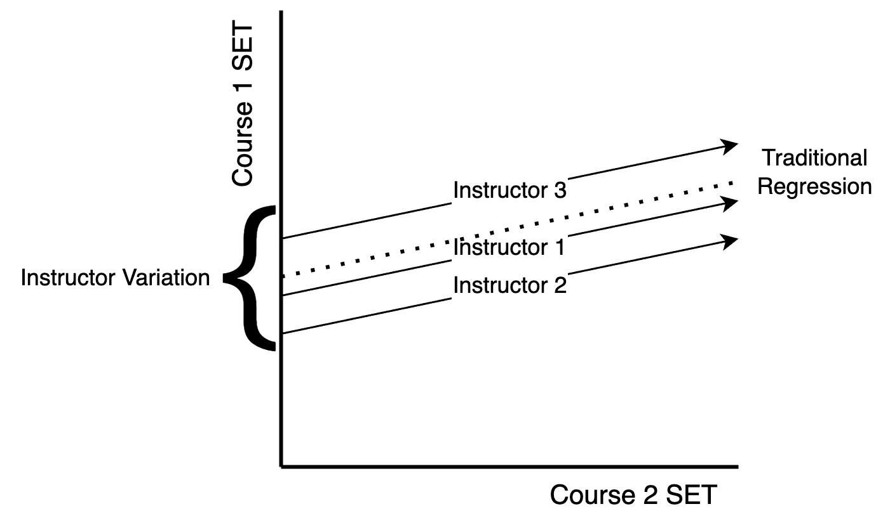

```{r setup, include = FALSE}
library("papaja")
```

```{r analysis-preferences}
# Seed for random number generation
set.seed(89432289)
knitr::opts_chunk$set(cache.extra = knitr::rand_seed, echo = FALSE, include = FALSE, cache = TRUE, cache.lazy = FALSE)
library(rio)
library(dplyr)
library(nlme)
library(effectsize)
library(ggplot2)
library(ppcor)
library(MuMIn)
```

```{r eval = F}
library(trackdown)
# initial set up 
# upload_file(file = "PG_Manuscript_2023.Rmd",
#       gfile = "grade_lean_trackdown")
# from google 
download_file(file = "PG_Manuscript_2023.Rmd",
              gfile = "grade_lean_trackdown")
# to google
update_file(file = "PG_Manuscript_2023.Rmd",
            gfile = "grade_lean_trackdown"
            rich_text = TRUE,
            hide_code = TRUE)
```

In the United States, college and university professors are evaluated to
varying degrees on research productivity, service, and teaching
effectiveness. These dimensions are often used for high-stakes
administration decisions, including hiring, retention, promotion, pay,
and tenure [@freishtat2014; @hornstein2017; @spooren2013; @stroebe2020].
Depending on the institution, a major failure of one of these evaluative
dimensions could jeopardize a professor's position within the
department; thus, professors are urged to maintain high standards of
research, service, and teaching. Indeed, the vast majority of the 9,000
professors polled by the American Association of University Professors
believed the teaching evaluative dimension should be taken as seriously
as research and service [@flaherty]. The consequences of teacher
effectiveness may motivate collegiate faculty into actively considering
the quality of their classroom.

Teaching effectiveness can be defined as the degree to which student
achievement is facilitated [i.e., how much have students learned in a
particular course, @cohen1981]. Generally, assessments of teaching
effectiveness come from student evaluations of teaching (SETs) or the
course itself [e.g., "Student Opinion of Instruction", "Students Opinion
of Teaching Effectiveness", "Students Evaluation of Faculty", "Overall
Course Ratings", "Instruction Rating", @cohen1981; @flahertya]. Often
these metrics are described as evaluating the "quality" of the
individual or course [@marsh2007; @gillmore1978]. Teaching effectiveness
measures are intended to gauge multiple facets of teaching, such as an
instructor's proficiency in communication, organization, presentation,
and grading [@hattie1996]. Given the use of SETs in administrative
decisions, both the reliability and validity of these measures should be
demonstrated to ensure their utility. Thus, the question naturally
arises: are SETs reliable and valid measures of teaching effectiveness?

## Validity

Sheehan's [-@sheehan1975] review of instructor evaluation literature
found such measures contained multiple factors potentially conducive to
bias. These include 1) student demographics: gender, class, age,
previous achievement, 2) class type: subject matter, size, degree
requirements, and 3) instructor qualities: gender, rank, gender-match to
student, etc. Decades later, studies still show that sexism
[@macnell2015; @mitchell2018], racism [@smith2011], and general biases
pervade students' evaluations today in both traditional courses and
possibly online ones as well [@heffernan2022; @rovai2006; @zheng2023;
@osullivan2014] Individual factors may also yield some influence on SET
ratings, including instructors' cultural background [@fan2019],
attractiveness [@felton2008; @wright2000], position ranking
[@johnson2013], and students' expected grade from the course [@chen2017;
@crumbley2001; @marks2000]. Biasing factors may even include the volume
of the instructor's voice and how legible their instructor's writing is
[@becker2012]. Concerningly, @stroebe2020 also highlights the danger of
an incentive system tied to student ratings; in other words, instructors
may be incentivized to be a less effective teacher (e.g., grade
leniently, choose to teach courses based on student interest, etc.)
rather than challenge students critically to boost their SET ratings.

Concerns of bias have not dissipated over time [@boring2016; @uttl2017;
@hornstein2017; @dunn2014]. Recent meta-analyses suggest SETs may be
entirely unrelated to material learned [@uttl2017], and potentially
biasing aspects cannot be altered due to their complex interactions
[@boring2016]. While students' ratings may show some utility in
indicating to their peers which classes to pursue and which professor to
take [@ratings], this usefulness may come at the cost of the professor's
self-efficacy [@boswell2016]. While SETs are conceptually valuable
towards gaining insight on teacher effectiveness or course quality, the
many outstanding issues suggest they may not be valid measures. Even so,
some researchers argue that the complete removal of SETs from
administrative consideration is the wrong course of action
[@benton2016]. A more appropriate solution may be to utilize multiple
measures of teaching effectiveness simultaneously [e.g., subject-matter
experts sit-in on lecture, peer reviews of course curriculum,
@benton2018; @berk2018; @esarey2020; @kornell2016]. However, the cost of
implementing a more accurate, multi-pronged approach may be unrealistic
given a university's budget and expectations of the instructor.
Institutions may then opt to continue using SETs regardless of their
validity.

## Perceived fairness

Extant research broadly supports that SETs are influenced by students'
grades. Some instructors may feel pressured into reducing the rigor of
their course for the sake of attaining higher SET ratings
[@greenwald1997; @marks2000]. However, as pointed out by @wright2000,
students' expectations of their final grades may not affect their SET
ratings nearly as much as their perceived fairness of their grades or
the grading process that produced them. Professors who are consistent,
accurate, unbiased, and correctable in their grading may receive high
SET ratings regardless of how much a student learns or what his/her
final grade turns out to be [@horan2010; @leventhal1980]. Students'
grades may predict their SETs only so much as students perceive the
grading processes as fair [@tata1999]. Hence, students' perceptions of
fairness may be more akin to comprehensive, and hopefully valid,
assessments of the instructor rather than just face-value judgments of
their grade. Perceived fairness may also play a multifactorial role in
its influence on SETs. For example, @tripp2019 found that students'
perceived fairness of their instructors' grading processes affected
their perceived fairness of their assigned grade, which then translated
to their instructor evaluation ratings of teacher effectiveness.
Further, perceived fairness of the course workload and difficulty may be
inversely related to perceived fairness of the grading process as a
challenging professor may be thought of as less fair [@marks2000].
Access to grading criteria, frequency of feedback, and proactive
instruction are other aspects of grading thought to explicitly affect
perceived fairness [@pepper2008]. Therefore, the perceived fairness of
those aspects must also be considered when determining the impact of
perceived fairness on SET ratings, especially when different professors
teach the same course or teach multiple courses in the same semester.
The validity and reliability of SETs may then partially hinge on the
consistency of students' perceptions of fairness.

## Reliability

Past investigations of SETs concluded they are reliable measures
[@arubayi1987; @marsh1997]. Contemporary reviews have explored the
reliability of SETs when controlling for various factors. For example,
@benton2014 found SETs collected from the same class to be internally
consistent when teaching effectiveness was assessed through several
items. Even so, other data suggest that instructor, course, and student
factors each contribute meaningfully to the variance of student
evaluation ratings, which can influence their reliability
[@feistauer2017]. This result suggests SET ratings may be reliable over
time if the aspects of a classroom remain constant. However, few data
have explored the interactions of time with validity variables or how it
affects reliability among SETs in relation to perceived fairness
specifically. Thus, while previous research has explored teacher
effectiveness over time [@marsh2007], our study extends this work by
examining the reliability patterns of 30 years of SET data with respect
to various moderating influences.

## The current study

The current study is similar in scope to recent work [@boring2016;
@fan2019] in its analysis of teacher evaluations collected over an
extensive period. Boring et al.'s [-@boring2016] investigation on both
French instructors and U.S. teaching assistants' gender ranged across
five years. Similarly, @fan2019's investigated the topic across seven.
Their utilization of multi-sections has been described as the gold
standard for researching students' ratings. Thus, we aimed to follow
their lead by analyzing the reliability of students' ratings provided
the same or different instructor, course type, and/or semester of
enrollment in addition to testing reliability over more than 30 years of
data. We examined the impact of a potential validity variable on the
reliability of ratings using perceived fairness of grading. Therefore,
we sought to explore the following research questions:

Exploratory Research Questions:

1)  What is the reliability of student evaluations?
2)  Are student evaluations reliable across time?
3)  Is the average level of perceived fairness of the grading in the
    course a moderator of reliability in student evaluations over time?
4)  Does the average variability in instructor fairness rating moderate
    reliability of student evaluations over time?

The following was pre-registered as a secondary data analysis at:
<https://osf.io/czb4f>. The manuscript, code, and data can be found on
our Open Science Framework page at: <https://osf.io/k7zh2/> or GitHub:
<https://github.com/doomlab/Grade-Lean>. This manuscript was written
with the *R* packages *papaja* [@aust2022], *rio* [@becker2021], *dplyr*
[@R-dplyr], *nlme* [@pinheiro2017], *ggplot2* [@R-ggplot2], *MuMIn*
[@barton2020], *ppcor* [@kim2015], and *effectsize* [@ben-shachar2023].

# Method

## Data Source

```{r import-data}
# please note the data is deidentified but timing and course number is accurate
DF <- import("data/final_evals.csv")
# we will only use courses with at least 15 ratings ... look at the paper that may be reliable (2013)
DF_sample <- DF %>% 
  filter(People >= 15)
# for this pre-reg we will randomly sample 20 percent of instructors 
# random_sample <- sample(unique(DF_sample$instructor_code), 
#                         size = round(length(unique(DF_sample$instructor_code)) * .30),
#                         replace = FALSE)
# 
# DF_sample <- DF_sample %>% 
#   filter(instructor_code %in% random_sample)
```

The archival study was conducted using data from the psychology
department at a large Midwestern public university. We used data from
`r nrow(DF_sample[ DF_sample$course_level == "undergraduate" , ])`
undergraduate, `r nrow(DF_sample[ DF_sample$course_level == "mixed", ])`
mixed-level undergraduate, and
`r nrow(DF_sample[ DF_sample$course_level == "masters" , ])` graduate
psychology classes taught from 1987 to 2018 that were evaluated by
students using the same 15-item instrument. Faculty followed set
procedures in distributing scan forms no more than two weeks before the
conclusion of the semester. A student was assigned to collect the forms
and deliver them to the departmental secretary. The instructor was
required to leave the room while students completed the forms. In the
last several years of evaluations, online versions of these forms were
used with faculty encouraged to give students time to complete them in
class while they were outside the classroom.

The questionnaire given to students can be found at
<https://osf.io/4sphx>. These items were presented with a five-point
scale from 1 (*strongly disagree*) to 5 (*strongly agree*). For this
study, the overall instructor evaluation question was "The overall
quality of this course was among the top 20% of those I have taken." For
fairness, we used the question of "The instructor used fair and
appropriate methods in the determination of grades." The ratings were
averaged for each course, and the sample size for each rating was
included.

## Planned Analyses

The evaluations were filtered for those with at least fifteen student
ratings for the course [@rantanen2012]. We performed a robustness check
for the first research question on the data when the sample size is at
least *n* = 10 up to *n* = 14 (i.e., on all evaluations with at least 10
ratings, then at least 11 ratings, etc.) to determine if the reliability
estimates are stable at lower sample sizes. We first screened the
dataset (two evaluation questions, sample size for course) for accuracy
errors, linearity, normality, and homoscedasticity. The data is assumed
to not have traditional "outliers", as these evaluations represent true
averages from student evaluations. If the linearity assumption fails, we
considered potential nonparametric models to address non-linearity.
Deviations from normality were noted as the large sample size should
provide robustness for any violations of normality. If data appears to
be heteroscedastic, we used bootstrapping to provide estimates and
confidence intervals.

This data was considered structured by instructor; therefore, all
analyses below were coded in *R* using the *nlme* package
[@pinheiro2017] to control for correlated error of instructor as a
random intercept in a multilevel model. Multilevel models allow for
analysis of repeated measures data without collapsing by participant
[i.e., each instructor/semester/course combination can be kept separate
without averaging over these measurements, @gelman2006]. Random
intercept models are regression models on repeated data that structure
the data by a specified variable, which was instructor in this analysis.
Therefore, each instructor's average rating score was allowed to vary
within the analysis, as ratings would be expected to be different from
instructor to instructor. See Figure \@ref(fig:fig-regression) for a visual depiction of the analysis. In each of the analyses described below, the
number of students providing ratings for the course was included as a
control variable to even out differences in course size as an influence
in the results. However, this variable was excluded if the models did
not converge. The dependent variable and predictors varied based on the
research question, and these are described with each analysis below.

### RQ 1

In this research question, we examined the reliability of student
evaluations on the overall rating and separately on the fairness rating.
We calculated eight types of reliability using course (same or
different) by instructor (same or different) by semester (same or
different). The dependent variable was the first question average with a
predictor of the comparison question average, and both sample sizes
(first sample size, comparison sample size). Instructor code was used as
the random intercept for both ratings (i.e., two instructor random
intercepts, first and comparison). The value of interest was the
standardized regression coefficient for the fixed effect of question
from this model. Given that the large sample size will likely produce
"significant" *p*-values, we used the 95% CI to determine which
reliability values were larger than zero and to compare reliability
estimates to each other. 

```{r fig-regression, fig.cap = "An example of Research Question 1 including random intercepts for instructor. Each instructor shows a different overall course average score where the regression line crosses the y-intercept. The idea behind using random intercepts is that instructors naturally vary in their overall average scores for evaluations based on skill and confounding factors such as age, gender, or course taught. This analysis controls for those differences to examine the pattern of reliability regardless of those facets."}

```

### RQ 2

We used the reliability for the same instructor and course calculated as
described in RQ1 at each time point difference between semesters. For
example, the same semester would create a time difference of 0. The next
semester (Spring to Summer, Summer to Fall, Fall to Spring) would create
a time difference of 1. We used the time difference as a fixed effect to
predict reliability for the overall question only with a random
intercept of instructor. We used the coefficient of time difference and
its confidence interval to determine if there was a linear change over
time. Finally, we plotted the changes over time to examine if this
effect was non-linear in nature and discussed implications of the graph.

### RQ 3

Using the reliability estimates from RQ 2, we then added the average
rating for the fairness question as the moderator with time to predict
reliability. Fairness was calculated as the average of the fairness
question for all courses involved in the reliability calculation for
that instructor and time difference. Therefore, this rating represented
the average perceived fairness of grading at the time of ratings. If
this interaction effect's coefficient does not include zero, we
performed a simple slopes analysis to examine the effects of instructors
who were rated at average fairness, one standard deviation below
average, and one standard deviation above average [@cohen2003].

### RQ 4

Finally, we examined the average standard deviation of fairness ratings
as a moderator of time to predict reliability. This variable represented
the variability in perceived fairness in grading from student
evaluations, where small numbers indicated relative agreement on the
rating of fairness and larger values indicated a wide range of fairness
ratings. The variability in fairness ratings was calculated in the same
way as the mean fairness, which was only for the instructor and semester
time difference evaluations that were used to calculate the reliability
estimate. This research question was assessed the same way as research
question three.

# Results

## Data Screening

```{r datascreening, include = FALSE}
random <- rchisq(nrow(DF_sample), 7)
output <- lm(random ~ ., data = DF_sample %>% dplyr::select(People, Q1AVG, Q4AVG))
standardized <- rstudent(output)
fitvalues <- scale(output$fitted.values)
#linear
{qqnorm(standardized)
abline(0,1)}
#multivariate normality
hist(standardized, breaks=15)
#homogeneity and homoscedasticity
{plot(fitvalues, standardized) 
abline(0,0)
abline(v = 0)}
```

The overall dataset was screened for normality, linearity, homogeneity,
and homoscedasticity using procedures from @tabachnick2019. Data
generally met assumptions with a slight skew and some heterogeneity. The
complete anonymized dataset and other information can be found online at
<https://osf.io/k7zh2>. This page also includes the manuscript written
inline with the statistical analysis with the *papaja* package
[@aust2022] for interested researchers/reviewers who wish to recreate
these analyses. The bootstrapped versions of analyses and robustness
analysis can be found online on our OSF page with a summary of results.
We originally planned to bootstrap all analyses; however, the compute
time for research question 1 was prolonged due to the size and
complexity of the multilevel models. We therefore did not bootstrap that
research question.

## Descriptive Statistics

`r nrow(DF_sample)` evaluations included at least 15 student evaluations
for analysis. Table \@ref(tab:table1) portrays the descriptive
statistics for each course level including the total number of
evaluations, unique instructors, unique course numbers, and average
scores for the two rating items. Students additionally projected their
course grade for each class (*A* = 5, *B* = 4, *C* = 3, *D* = 2, *F* =
1), and the average for this item is included for reference. Overall,
`r length(unique(DF_sample$instructor_code))` unique instructors and
`r length(unique(DF_sample$new_course))` unique courses were included in
the analyses below across `r max(DF_sample$semester_count) + 1`
semesters.

```{r table1, results = 'asis', include = TRUE}
DF_summary <- DF_sample %>% 
  group_by(course_level) %>% 
  summarize(totaln = n(), 
            num_instruct = length(unique(instructor_code)),
            num_courses = length(unique(new_course)),
            avg_people = apa_num(mean(People, na.rm = T)), 
            avgq1 = apa_num(mean(Q1AVG, na.rm = T)), 
            avgsd1 = apa_num(sd(Q1AVG, na.rm = T)), 
            avgq4 = apa_num(mean(Q4AVG, na.rm = T)),
            avgsd4 = apa_num(sd(Q4AVG, na.rm = T)),
            avgq15 = apa_num(mean(Q15AVG, na.rm = T)), 
            avgsd15 = apa_num(sd(Q15AVG, na.rm = T))) %>% 
  arrange(desc(course_level))
temp <- DF_summary %>% 
  t() %>% 
  as.data.frame() %>% 
  slice(-1)
temp$stat <- c("N Total", "N Instructors", "N Courses",
               "Average N Ratings", "Average Overall", 
               "SD Overall", "Average Fairness", 
               "SD Fairness", "Average Grade", "SD Grade")
apa_table(temp[ , c(4, 1:3)], 
          caption = "Descriptive Statistics of Included Courses", 
            row.names = FALSE, 
            col.names = c("Statistic", "Undergraduate", "Mixed", "Master's"))
```

## RQ 1

```{r rq1-nlme}
# let's see if twitter can help here - yes! @smartin2018 for the win!
# create unique id
DF_sample$evalid <- 1:nrow(DF_sample)
# create every pairwise combination 
combns <- t(combn(DF_sample$evalid,2))
# create a dataframe to hold that information, remove other frame for the love of space
longrel <- data.frame(evalid=combns[,1],evalid2=combns[,2]); rm(combns)
# add person 1 information back to dataframe
templong <- merge(longrel, DF_sample, by = "evalid")
colnames(templong)[1:2] <- c("evalid1", "evalid")
# add person 2 information back to the dataframe, remove other frame for the love of space
longrel <- merge(templong, DF_sample, by = "evalid")
rm(templong)
# create factors
longrel$instructormatch <- as.numeric(longrel$instructor_code.x == longrel$instructor_code.y)
longrel$semestermatch <- as.numeric(longrel$semester_count.x == longrel$semester_count.y)
longrel$coursematch <- as.numeric(longrel$new_course.x == longrel$new_course.y)
#look at the contingency table
#table(longrel$instructormatch, longrel$semestermatch, longrel$coursematch)
# dataframe to put stuff in ----
betarel <- matrix(NA, nrow = 2*2*2*2, ncol = 4+3)
# going to let these overwrite each other so memory isn't bonkers
# semester, course, instructor
## same same same ----
relq1 <- lme(Q1AVG.y ~ Q1AVG.x + People.x + People.y, 
           data = longrel[ longrel$semestermatch == 1 & 
                             longrel$coursematch == 1 & 
                             longrel$instructormatch == 1, ], 
           method = "ML", 
           na.action = "na.omit",
           random = list(~1|instructor_code.x, ~1|instructor_code.y),
           control = lmeControl(opt = "optim"))
temp <- standardize_parameters(relq1)
betarel[1 , ] <- c(1,1,1,"Overall", temp$Std_Coefficient[2], temp$CI_low[2], temp$CI_high[2])
rm(relq1)
relq4 <- lme(Q4AVG.y ~ Q4AVG.x + People.x + People.y, 
           data = longrel[ longrel$semestermatch == 1 & 
                             longrel$coursematch == 1 & 
                             longrel$instructormatch == 1, ], 
           method = "ML", 
           na.action = "na.omit",
           random = list(~1|instructor_code.x, ~1|instructor_code.y), 
           control = lmeControl(opt = "optim"))
temp <- standardize_parameters(relq4)
betarel[2 , ] <- c(1,1,1,"Fair", temp$Std_Coefficient[2], temp$CI_low[2], temp$CI_high[2])
rm(relq4)
## same same different ----
relq1 <- lme(Q1AVG.y ~ Q1AVG.x + People.x + People.y, 
           data = longrel[ longrel$semestermatch == 1 & 
                             longrel$coursematch == 1 & 
                             longrel$instructormatch == 0, ], 
           method = "ML", 
           na.action = "na.omit",
           random = list(~1|instructor_code.x, ~1|instructor_code.y), 
           control = lmeControl(opt = "optim"))
temp <- standardize_parameters(relq1)
betarel[3 , ] <- c(1,1,0,"Overall", temp$Std_Coefficient[2], temp$CI_low[2], temp$CI_high[2])
rm(relq1)
relq4 <- lme(Q4AVG.y ~ Q4AVG.x + People.x + People.y, 
           data = longrel[ longrel$semestermatch == 1 & 
                             longrel$coursematch == 1 & 
                             longrel$instructormatch == 0, ], 
           method = "ML", 
           na.action = "na.omit",
           random = list(~1|instructor_code.x, ~1|instructor_code.y), 
           control = lmeControl(opt = "optim"))
temp <- standardize_parameters(relq4)
betarel[4 , ] <- c(1,1,0,"Fair", temp$Std_Coefficient[2], temp$CI_low[2], temp$CI_high[2])
rm(relq4)
## same different same ----
relq1 <- lme(Q1AVG.y ~ Q1AVG.x + People.x + People.y, 
           data = longrel[ longrel$semestermatch == 1 & 
                             longrel$coursematch == 0 & 
                             longrel$instructormatch == 1, ], 
           method = "ML", 
           na.action = "na.omit",
           random = list(~1|instructor_code.x, ~1|instructor_code.y), 
           control = lmeControl(opt = "optim"))
temp <- standardize_parameters(relq1)
betarel[5 , ] <- c(1,0,1,"Overall", temp$Std_Coefficient[2], temp$CI_low[2], temp$CI_high[2])
rm(relq1)
relq4 <- lme(Q4AVG.y ~ Q4AVG.x + People.x + People.y, 
           data = longrel[ longrel$semestermatch == 1 & 
                             longrel$coursematch == 0 & 
                             longrel$instructormatch == 1, ], 
           method = "ML", 
           na.action = "na.omit",
           random = list(~1|instructor_code.x, ~1|instructor_code.y), 
           control = lmeControl(opt = "optim"))
temp <- standardize_parameters(relq4)
betarel[6 , ] <- c(1,0,1,"Fair", temp$Std_Coefficient[2], temp$CI_low[2], temp$CI_high[2])
rm(relq4)
## same different different ----
relq1 <- lme(Q1AVG.y ~ Q1AVG.x + People.x + People.y, 
           data = longrel[ longrel$semestermatch == 1 & 
                             longrel$coursematch == 0 & 
                             longrel$instructormatch == 0, ], 
           method = "ML", 
           na.action = "na.omit",
           random = list(~1|instructor_code.x, ~1|instructor_code.y), 
           control = lmeControl(opt = "optim"))
temp <- standardize_parameters(relq1)
betarel[7 , ] <- c(1,0,0,"Overall", temp$Std_Coefficient[2], temp$CI_low[2], temp$CI_high[2])
rm(relq1)
relq4 <- lme(Q4AVG.y ~ Q4AVG.x + People.x + People.y, 
           data = longrel[ longrel$semestermatch == 1 & 
                             longrel$coursematch == 0 & 
                             longrel$instructormatch == 0, ], 
           method = "ML", 
           na.action = "na.omit",
           random = list(~1|instructor_code.x, ~1|instructor_code.y), 
           control = lmeControl(opt = "optim"))
temp <- standardize_parameters(relq4)
betarel[8 , ] <- c(1,0,0,"Fair", temp$Std_Coefficient[2], temp$CI_low[2], temp$CI_high[2])
rm(relq4)
## different different different ----
relq1 <- lme(Q1AVG.y ~ Q1AVG.x + People.x + People.y, 
           data = longrel[ longrel$semestermatch == 0 & 
                             longrel$coursematch == 0 & 
                             longrel$instructormatch == 0, ], 
           method = "ML", 
           na.action = "na.omit",
           random = list(~1|instructor_code.x, ~1|instructor_code.y), 
           control = lmeControl(opt = "optim"))
temp <- standardize_parameters(relq1)
betarel[9 , ] <- c(0,0,0,"Overall", temp$Std_Coefficient[2], temp$CI_low[2], temp$CI_high[2])
rm(relq1)
relq4 <- lme(Q4AVG.y ~ Q4AVG.x + People.x + People.y, 
           data = longrel[ longrel$semestermatch == 0 & 
                             longrel$coursematch == 0 & 
                             longrel$instructormatch == 0, ], 
           method = "ML", 
           na.action = "na.omit",
           random = list(~1|instructor_code.x, ~1|instructor_code.y), 
           control = lmeControl(opt = "optim"))
temp <- standardize_parameters(relq4)
betarel[10 , ] <- c(0,0,0,"Fair", temp$Std_Coefficient[2], temp$CI_low[2], temp$CI_high[2])
rm(relq4)
## different same different ----
relq1 <- lme(Q1AVG.y ~ Q1AVG.x + People.x + People.y, 
           data = longrel[ longrel$semestermatch == 0 & 
                             longrel$coursematch == 1 & 
                             longrel$instructormatch == 0, ], 
           method = "ML", 
           na.action = "na.omit",
           random = list(~1|instructor_code.x, ~1|instructor_code.y), 
           control = lmeControl(opt = "optim"))
temp <- standardize_parameters(relq1)
betarel[11 , ] <- c(0,1,0,"Overall", temp$Std_Coefficient[2], temp$CI_low[2], temp$CI_high[2])
rm(relq1)
relq4 <- lme(Q4AVG.y ~ Q4AVG.x + People.x + People.y, 
           data = longrel[ longrel$semestermatch == 0 & 
                             longrel$coursematch == 1 & 
                             longrel$instructormatch == 0, ], 
           method = "ML", 
           na.action = "na.omit",
           random = list(~1|instructor_code.x, ~1|instructor_code.y), 
           control = lmeControl(opt = "optim"))
temp <- standardize_parameters(relq4)
betarel[12 , ] <- c(0,1,0,"Fair", temp$Std_Coefficient[2], temp$CI_low[2], temp$CI_high[2])
rm(relq4)
## different different same ----
relq1 <- lme(Q1AVG.y ~ Q1AVG.x + People.x + People.y, 
           data = longrel[ longrel$semestermatch == 0 & 
                             longrel$coursematch == 0 & 
                             longrel$instructormatch == 1, ], 
           method = "ML", 
           na.action = "na.omit",
           random = list(~1|instructor_code.x, ~1|instructor_code.y), 
           control = lmeControl(opt = "optim"))
temp <- standardize_parameters(relq1)
betarel[13 , ] <- c(0,0,1,"Overall", temp$Std_Coefficient[2], temp$CI_low[2], temp$CI_high[2])
rm(relq1)
relq4 <- lme(Q4AVG.y ~ Q4AVG.x + People.x + People.y, 
           data = longrel[ longrel$semestermatch == 0 & 
                             longrel$coursematch == 0 & 
                             longrel$instructormatch == 1, ], 
           method = "ML", 
           na.action = "na.omit",
           random = list(~1|instructor_code.x, ~1|instructor_code.y), 
           control = lmeControl(opt = "optim"))
temp <- standardize_parameters(relq4)
betarel[14 , ] <- c(0,0,1,"Fair", temp$Std_Coefficient[2], temp$CI_low[2], temp$CI_high[2])
rm(relq4)
## different same same ----
relq1 <- lme(Q1AVG.y ~ Q1AVG.x + People.x + People.y, 
           data = longrel[ longrel$semestermatch == 0 & 
                             longrel$coursematch == 1 & 
                             longrel$instructormatch == 1, ], 
           method = "ML", 
           na.action = "na.omit",
           random = list(~1|instructor_code.x, ~1|instructor_code.y), 
           control = lmeControl(opt = "optim"))
temp <- standardize_parameters(relq1)
betarel[15 , ] <- c(0,1,1,"Overall", temp$Std_Coefficient[2], temp$CI_low[2], temp$CI_high[2])
rm(relq1)
relq4 <- lme(Q4AVG.y ~ Q4AVG.x + People.x + People.y, 
           data = longrel[ longrel$semestermatch == 0 & 
                             longrel$coursematch == 1 & 
                             longrel$instructormatch == 1, ], 
           method = "ML", 
           na.action = "na.omit",
           random = list(~1|instructor_code.x, ~1|instructor_code.y), 
           control = lmeControl(opt = "optim"))
temp <- standardize_parameters(relq4)
betarel[16 , ] <- c(0,1,1,"Fair", temp$Std_Coefficient[2], temp$CI_low[2], temp$CI_high[2])
rm(relq4)
betarel <- as.data.frame(betarel)
colnames(betarel) <- c("Semester", "Course", "Instructor", "Question",
                      "b", "CI_Low", "CI_High")
```

Each individual evaluation was compared to every other evaluation
resulting in `r nrow(longrel)` total comparisons. Eight combinations of
ratings were examined using instructor (same, different), course (same,
different), and semester (same, different) on both the overall and
fairness evaluation ratings separately. One of the individual ratings
was used to predict the comparison rating (i.e., question 1 was used to
predict a comparison question 1 for the same instructor, different
instructor, same semester, different semester, etc.), and the number of
ratings (i.e., rating sample size) per question were used as
fixed-effects covariates. The instructor(s) were used as a random
intercept to control for correlated error and overall average rating per
instructor. The effects were then standardized using the *parameters*
package [@lüdecke2023]. The data was sorted by year and semester such
that "predictor" was always an earlier semester predicting a later
semester's scores, except in cases of the same semester comparisons.
Therefore, positive standardized scores indicate that scores tend to go
up over time, while negative scores indicate that scores tend to go down
over time.

As shown in Figure \@ref(fig:figure1), reliability was highest when
calculated on the same instructor in the same semester and within the
same course for both overall rating and fairness. This reliability was
followed by the same instructor, same semester, and different courses.
Next, the reliability for same instructor, same course, and different
semesters was greater than zero and usually overlapped in confidence
interval with same instructor, same semester, and different courses.
Interestingly, the same instructor with different courses and semesters
showed a non-zero negative relationship, indicating that ratings
generally were lower for later semesters in different courses.

For different instructors, we found positive non-zero readabilities when
they were at least calculated on the same semester or course. These
values were very close to zero, generally in the .01 to .05 range. The
reliabilities that were calculated on different courses, semesters, and
instructors include zero in their confidence intervals. Exact values can
be found in the online supplemental document with the robustness
analysis in .csv format. Robustness analyses revealed the same pattern
and strength of results for evaluation reliabilities when sample size
for evaluations was considered at *n* = 10, 11, 12, 13, and 14.

```{r figure1, include = TRUE, fig.cap= "Reliability estimates for instructor, course, and semester combinations."}
betarel$b <- as.numeric(betarel$b)
betarel$CI_Low <- as.numeric(betarel$CI_Low)
betarel$CI_High <- as.numeric(betarel$CI_High)
betarel$Semester_nice <- factor(betarel$Semester, 
                           levels = c(0,1),
                           labels = c("Different", "Same"))
betarel$Instructor_nice <- factor(betarel$Instructor, 
                           levels = c(0,1),
                           labels = c("Different Instructor", "Same Instructor"))
betarel$Course_nice <- factor(betarel$Course, 
                           levels = c(0,1),
                           labels = c("Different Course", "Same Course"))
write.csv(betarel, "output/beta_values_rq1.csv", row.names = F)
ggplot(betarel, aes(Semester_nice, b, color = Course_nice)) + 
  geom_point() + 
  geom_errorbar(aes(ymin = CI_Low, ymax = CI_High), width = 0.2) + 
  theme_classic() + 
  facet_grid(Question~Instructor_nice) + 
  ylab("Reliability") + 
  xlab("Semester Match") + 
  scale_color_discrete(name = "Course Match")
ggsave("output/figure1.png")
```

## RQ 2

```{r rq2-setup, warning = FALSE}
# filter to only matches
long_match <- longrel %>% 
  filter(coursematch == 1) %>% 
  filter(instructormatch == 1) %>% 
  dplyr::select(instructor_code.x, semester_count.x, People.x, Q1AVG.x, Q4AVG.x, 
         instructor_code.y, semester_count.y, People.y, Q1AVG.y, Q4AVG.y) %>% 
  mutate(semester_diff = round(semester_count.y - semester_count.x))
# figure out the number each person has and need at least 10
long_summary <- long_match %>% 
  group_by(instructor_code.x, semester_diff) %>% 
  summarize(total_n = n(), .groups = "keep", 
            avg_fair = mean(c(Q4AVG.x, Q4AVG.y), na.rm = T), 
            std_fair = sd(c(Q4AVG.x, Q4AVG.y), na.rm = T)) %>% 
  filter(total_n >= 10) %>% 
  mutate(code = paste0(instructor_code.x, semester_diff))
long_match$code <- paste0(long_match$instructor_code.x, long_match$semester_diff)
save_rel <- data.frame(
  code = 1:nrow(long_summary), 
  rel = 1:nrow(long_summary)
)
for (i in 1:nrow(long_summary)){
  temp <- long_match %>% 
    filter(code %in% long_summary$code[i]) %>% 
    dplyr::select(Q1AVG.x, Q1AVG.y, People.x, People.y) %>% 
    pcor()
  save_rel$code[i] <- long_summary$code[i]
  save_rel$rel[i] <- temp$estimate[2, 1]
}
save_rel <- save_rel %>% 
  left_join(long_summary %>% dplyr::select(code, instructor_code.x, semester_diff, avg_fair, std_fair) %>% unique(), by = "code")
```

The paired evaluations were then filtered to only examine course and
instructor matches to explore the relation of reliability across time.
Reliability was calculated by calculating the partial correlation
between the overall rating for the course first evaluation and the
overall rating for the course second evaluation, controlling for the
number of ratings within those average scores. This reliability was
calculated separately for each instructor and semester difference (i.e.,
the time between evaluations, zero means same semester, one means the
next semester, two means two semesters later, etc.). The ratings were
filtered so that at least 10 pairs of ratings were present for each
instructor and semester difference combination [@weaver2014]. Of
`r nrow(long_match)` possible matched instructor and course pairings,
`r nrow(long_match %>% filter(code %in% long_summary$code))` included at
least 10 pairings, which was `r nrow(long_summary)` total instructor and
semester combinations.

```{r rq2-nlme}
rq2.model <- lme(rel ~ semester_diff, 
                 data = save_rel,
                 random = list(~1|instructor_code.x), 
                 method = "ML", 
                 na.action = "na.omit",
                 control = lmeControl(opt = "optim"))
coef.rq2 <- summary(rq2.model)$tTable
ci.rq2 <- intervals(rq2.model)
```

The confidence interval for the effect of semester difference predicting
reliability did not cross zero, *b* =
`r apa_num(coef.rq2[2 , 1], digits = 3)`, 95% CI
[`r apa_num(ci.rq2$fixed[2,1], digits = 3)`,
`r apa_num(ci.rq2$fixed[2,3], digits = 3)`], $R^2$ =
`r suppressWarnings(apa_num(as.numeric(r.squaredGLMM(rq2.model)[1]), gt1 = FALSE))`.
The coefficient, while small, represents a small effect of time on the
reliability of instructor ratings. As shown in Figure
\@ref(fig:figure2), reliability appears to decrease across time.

```{r figure2, include = TRUE, fig.cap = "Reliability estimates for same instructor and course across time.", message = F}
ggplot(save_rel, aes(semester_diff, rel)) + 
  geom_point(alpha = .5) + 
  theme_classic() + 
  xlab("Semester Difference") + 
  ylab("Reliability") + 
  geom_smooth(method = "lm", color = "black") 
ggsave("output/figure2.png")
```

## RQ 3

```{r rq3-nlme}
# center the variables
save_rel$avg_fair_center <- scale(save_rel$avg_fair, scale = FALSE)
save_rel$avg_fair_low <- save_rel$avg_fair_center + sd(save_rel$avg_fair_center, na.rm = T)
save_rel$avg_fair_high <- save_rel$avg_fair_center - sd(save_rel$avg_fair_center, na.rm = T)
save_rel$z_semester_diff <- scale(save_rel$semester_diff, scale = FALSE)
rq3.model <- lme(rel ~ z_semester_diff*avg_fair_center, 
                 data = save_rel,
                 random = list(~1|instructor_code.x), 
                 method = "ML", 
                 na.action = "na.omit",
                 control = lmeControl(opt = "optim"))
coef.rq3 <- summary(rq3.model)$tTable
ci.rq3 <- intervals(rq3.model)
rq3.model.low <- lme(rel ~ z_semester_diff*avg_fair_low, 
                 data = save_rel,
                 random = list(~1|instructor_code.x), 
                 method = "ML", 
                 na.action = "na.omit",
                 control = lmeControl(opt = "optim"))
coef.rq3.low <- summary(rq3.model.low)$tTable
rq3.model.high <- lme(rel ~ z_semester_diff*avg_fair_high, 
                 data = save_rel,
                 random = list(~1|instructor_code.x), 
                 method = "ML", 
                 na.action = "na.omit",
                 control = lmeControl(opt = "optim"))
coef.rq3.high <- summary(rq3.model.high)$tTable
```

The confidence interval for the interaction of semester time difference
and average fairness did cross zero, *b* =
`r apa_num(coef.rq3[4,1], digits = 3)`, 95% CI
[`r apa_num(ci.rq3$fixed[4, 1], digits = 3)`,
`r apa_num(ci.rq3$fixed[4, 3], digits = 3)`], $R^2$ =
`r suppressWarnings(apa_num(as.numeric(r.squaredGLMM(rq3.model)[1]), gt1 = FALSE))`.
Therefore, there was no effect of the interaction of average fairness
with semester differences in predicting reliability. Similarly, average
fairness did not predict reliability overall, *b* =
`r apa_num(coef.rq3[3,1], digits = 3)`, 95% CI
[`r apa_num(ci.rq3$fixed[3, 1], digits = 3)`,
`r apa_num(ci.rq3$fixed[3, 3], digits = 3)`].

```{r figure3, eval = FALSE, message = FALSE, include = TRUE, fig.cap="Example simple slope depiction for low, average, and high fairness scores used to moderate the relationship between semester time and reliability estimates."}
ggplot(save_rel, aes(z_semester_diff, rel)) + 
  geom_point(alpha = .1) + 
  theme_classic() + 
  xlab("Centered Semester Difference") + 
  ylab("Reliability") + 
  geom_abline(intercept = coef.rq3[1,1], slope = coef.rq3[3,1], color= "red", 
                 linetype= "dashed", linewidth = 1.5) + 
    geom_abline(intercept = coef.rq3.low[1,1], slope = coef.rq3.low[3,1], color= "green", 
                 linetype= "dotted", linewidth = 1.5) + 
    geom_abline(intercept = coef.rq3.high[1,1], slope = coef.rq3.high[3,1], color= "blue", 
                 linetype= "dashed", linewidth = 1.5) + 
  geom_vline(xintercept = 0) + 
  theme(axis.line.y = element_blank())
ggsave("output/figure3.png")
```

## RQ 4

```{r rq4-nlme}
# center the variables
save_rel$std_fair_center <- scale(save_rel$std_fair, scale = FALSE)
save_rel$std_fair_low <- save_rel$std_fair_center + sd(save_rel$std_fair_center, na.rm = T)
save_rel$std_fair_high <- save_rel$std_fair_center - sd(save_rel$std_fair_center, na.rm = T)
rq4.model <- lme(rel ~ z_semester_diff*std_fair_center, 
                 data = save_rel,
                 random = list(~1|instructor_code.x), 
                 method = "ML", 
                 na.action = "na.omit",
                 control = lmeControl(opt = "optim"))
coef.rq4 <- summary(rq4.model)$tTable
ci.rq4 <- intervals(rq4.model)
rq4.model.low <- lme(rel ~ z_semester_diff*std_fair_low, 
                 data = save_rel,
                 random = list(~1|instructor_code.x), 
                 method = "ML", 
                 na.action = "na.omit",
                 control = lmeControl(opt = "optim"))
coef.rq4.low <- summary(rq4.model.low)$tTable
rq4.model.high <- lme(rel ~ z_semester_diff*std_fair_high, 
                 data = save_rel,
                 random = list(~1|instructor_code.x), 
                 method = "ML", 
                 na.action = "na.omit",
                 control = lmeControl(opt = "optim"))
coef.rq4.high <- summary(rq4.model.high)$tTable
```

The confidence interval for the interaction of variability of fairness
and semester time difference did cross zero, *b* =
`r apa_num(coef.rq4[4,1], digits = 3)`, 95% CI
[`r apa_num(ci.rq4$fixed[4, 1], digits = 3)`,
`r apa_num(ci.rq4$fixed[4, 3], digits = 3)`], $R^2$ =
`r suppressWarnings(apa_num(as.numeric(r.squaredGLMM(rq4.model)[1]), gt1 = FALSE))`.
The variability of fairness also did not predict reliability overall,
*b* = `r apa_num(coef.rq4[3,1], digits = 3)`, 95% CI
[`r apa_num(ci.rq4$fixed[3, 1], digits = 3)`,
`r apa_num(ci.rq4$fixed[3, 3], digits = 3)`].

```{r figure4, eval = FALSE, message = FALSE, include = TRUE, fig.cap="Example simple slope depiction for low, average, and high fairness variability used to moderate the relationship between semester time and reliability estimates."}
ggplot(save_rel, aes(z_semester_diff, rel)) + 
  geom_point(alpha = .1) + 
  theme_classic() + 
  xlab("Centered Semester Difference") + 
  ylab("Reliability") + 
  geom_abline(intercept = coef.rq4[1,1], slope = coef.rq4[3,1], color= "red", 
                 linetype= "dashed", linewidth = 1.5) + 
    geom_abline(intercept = coef.rq4.low[1,1], slope = coef.rq4.low[3,1], color= "green", 
                 linetype= "dotted", linewidth = 1.5) + 
    geom_abline(intercept = coef.rq4.high[1,1], slope = coef.rq4.high[3,1], color= "blue", 
                 linetype= "dashed", linewidth = 1.5) + 
  geom_vline(xintercept = 0) + 
  theme(axis.line.y = element_blank())
ggsave("output/figure4.png")
```

# Discussion

This investigation measured the reliability of SETs by calculating the
reliability of evaluations across instructors, semesters, and courses.
Our first research question asked what the reliability of SETs was given
the instructor, course, or semester. Our data showed that SETs of the
same instructor within the same course and same semester were the most
reliable [*r*s \~ .50 --- 75th percentile of known psychology
correlations, @lovakov2021], followed by those collected from students
enrolled in the same course, with the same instructor, but in different
semesters (*r*s \~ .12 --- 25th percentile of known psychology
correlations). Our second question investigated if instructors' SETs
became more reliable with increasing years of teaching experience;
stated simply, we explored if experience across time matters. We
extended previous meta-analyses on reliability to show that reliability
appears to slightly, but significantly, decrease over time --- a new
finding in comparison to the work of @marsh2007. Given the small size of
this effect, reliability would decrease approximately .06 points in the
time normally designated for tenure and/or promotion (i.e., -0.004 x 3
semesters x 5 years). This small decrease may not impact the
administrative process, but it is worth considering that decreases in
reliability could be expected.

Last, we explored the relationship of a variable that we believed
potentially impacts the validity of SETs: perceived fairness in grading.
Perceived fairness did not appear to impact reliability scores, nor did
it moderate with time to predict reliability scores. While variability
in perceived fairness is found across and within instructor ratings,
this variability also did not impact reliability information. In other
words, our data does not support that instructors perceived as fair have
higher or lower reliability of their SETs. Further, it did not seem to
matter if all students agreed the instructor was fair (low variability
in perceived fairness) or if they disagreed (high variability in
perceived fairness) when predicting the reliability of SETs.

This study extends previous work with several new strengths [@marsh2007;
@benton2014; @benton2016; @zhao2011]. The data included in this
manuscript represents over 30 years of SETs and was analyzed for
reliability within and across courses, semesters, and instructors; thus,
providing new insights into the expected level of reliability in
different calculation scenarios. Sensitivity and bootstrapped analyses
show that these results are robust even with a smaller number of
evaluations used, supporting and extending work by @rantanen2012.
Further, we investigated the impact of validity variables on
reliability, not just the overall validity of SETs based on various
potential biases.

Given these results, what should instructors and administrators do with
student evaluations of teaching? @benton2018 provide a comprehensive
checklist of ways to assess teaching and interpret evaluations
considering the long history of validity questions for SETs. Here, we
add that it is important to understand that reliability will vary by
course and semester as instructor variability is usually expected. It is
tempting to think that the same instructor teaching the same course
should reliably get the same SET ratings; however, we should consider
that instructors will grow and change over time, which may contribute to
lessened reliability across time (in addition to other known biases,
such as age). Further, facets of the different courses taught likely
contribute to the lessened reliability between courses taught by the
same instructor (i.e., required statistics courses versus elective
courses). As @benton2018 describe, the evaluation procedure should be
useful, and it may not be fruitful to compare different years or even
courses. SETs should therefore be contextualized to the course and
semester in which they were received.

While this study provides valuable evidence about SET reliability, it
only includes the SET ratings of one department, and our descriptive
statistics suggest these ratings were often collected at ceiling on a 1
to 5 Likert-type scale. Moreover, SETs are always biased by the students
who are in class or fill out the online survey --- information about
missing student perceptions are never recorded. The concerns about the
validity of SETs are still relevant, and it may be that reliability is
interesting but not altogether useful if the scores are not valid
representations of teaching effectiveness. However, open-ended feedback,
paired with SET scores, are often a beneficial gauge for instructors to
reflect on new practices or how a semester progressed. As universities
struggle to balance demands of higher education cost and student
enrollment, teaching effectiveness may be a critical target for
administrators to ensure student engagement and retention. These results
suggest that SETs can be reliable indicators of teaching effectiveness,
but likely only within the same courses and semester. Thus, a
multifaceted approach to assessing instructor effectiveness and
improvement is a more appropriate measurement tool for long-term
evaluations of instruction [@benton2018].

\newpage

# References

::: {#refs custom-style="Bibliography"}
:::
